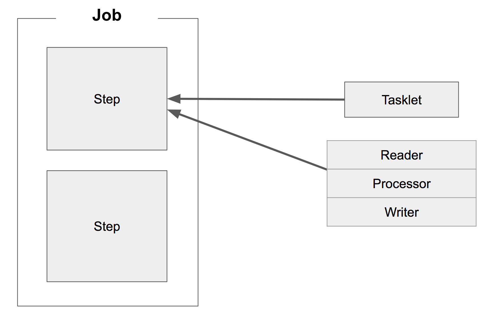
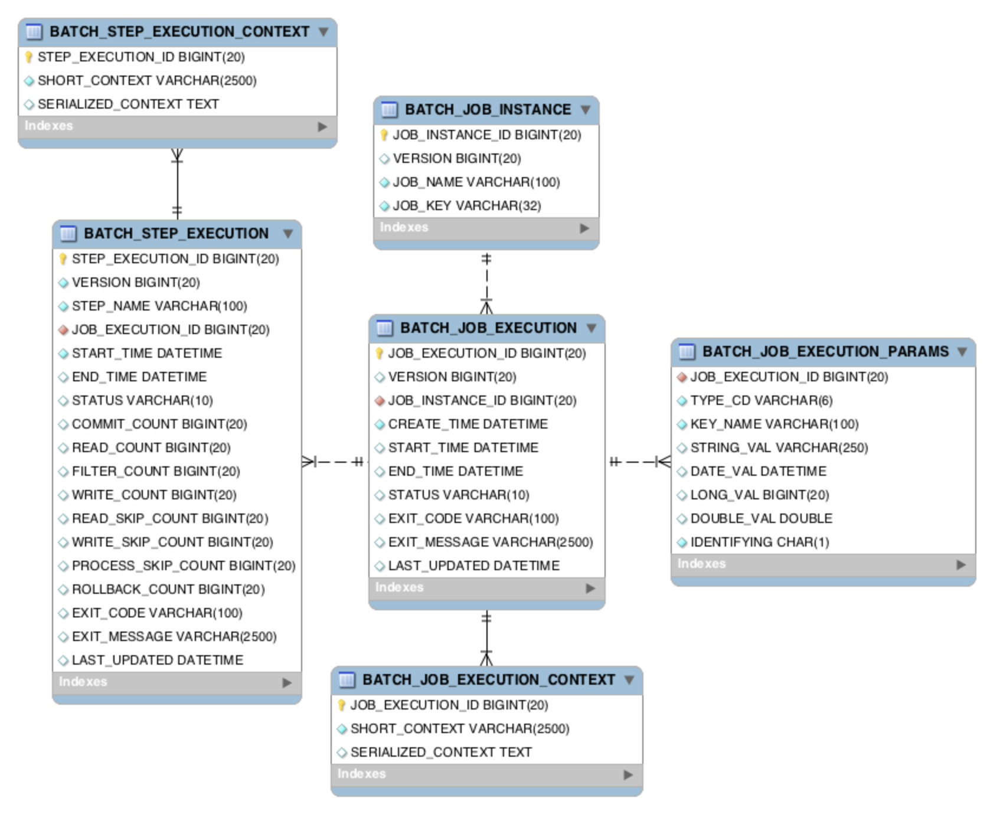
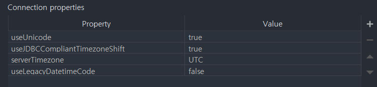
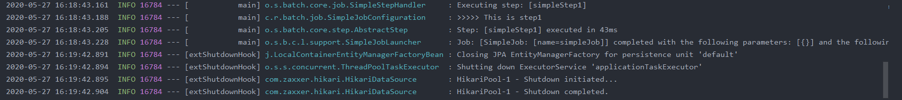

## Batch Job 실행해보기

```java
@Slf4j // 로깅
@RequiredArgsConstructor // 생성자 DI 용
@Configuration // Spring Batch의 모든 Job은 @config 등록
public class SimpleJobConfiguration {
    private final JobBuilderFactory jobBuilderFactory;
    private final StepBuilderFactory stepBuilderFactory;

    @Bean
    public Job simpleJob(){
        return jobBuilderFactory.get("simpleJob")
                .start(simpleStep1())
                .build();
    }

    @Bean
    public Step simpleStep1(){
        return stepBuilderFactory.get("simpleStep1")
                .tasklet((contribution, chunkContext) -> {
                    log.info(">>>>> This is step1");
                    return RepeatStatus.FINISHED;
                })
                .build();
    }
}
```

jobBuilderFactory.get("simpleJob")

- simpleJob이란 이름의 Batch Job 생성
- job이름은 별도 지정하지 않고 지금과 같이 Builder 통해 지정

stepBuilderFactory.get("simpleStep1")

- simpleStep1이란 이름의 Batch step 생성
- Builder 통해 이름 지정

tasklet((contribution, chunkContext))

- step 안에서 수행될 기능들 명시
- Tasklet은 Step 안에서 단일 수행될 커스텀한 기능들을 선언할때 사용
- 여기서는 Batch가 수행되면 log 출력되도록 설정

### Job이란?



- Job은 하나의 배치 작업 단위를 뜻한다
- Job 안에는 여러 Step이 존재하며 Step 안에 Tasklet 혹은 Reader & Processor & Writer 묶음이 존재
- Tasklet 하나와 Reader & Processor & Writer 한 묶음이 같은 레벨이므로 Reader & Processor가 끝나고 Tasklet으로 마무리 짓는 등은 불가능하다.

### MySQL 환경에서 Spring Batch 실행

Spring Batch에선 메타 데이터 테이블이 필요하다.

Spring Batch의 메타데이터

- 이전에 실행한 Job이 어떤 것들이 있는지
- 최근 실패한 Batch Parameter가 어떤것들이 있고, 성공한 Job은 어떤것들이 있는지
- 다시 실행한다면 어디서부터 시작하면 될지
- 어떤 Job에 어떤 Step들이 있었고, Step들 중 성공한 Step, 실패한 Step은 어떤것들이 있는지

**메타 테이블 구조**



이 테이블이 있어야만 Spring Batch가 정상 작동한다.

기본적으로 H2 DB를 사용할 경우엔 테이블을 Boot 실행시 자동으로 생성하지만, MySQL이나 Oracle과 같은 DB를 사용할 때는 개발자가 직접 생성해야 한다.

이미 Spring Batch에 해당 스키마가 존재하고 있고 이를 그대로 복사해서 `create table`하면 된다.

### MySQL 연동과정

1. application profile 설정

    #### application.yml

    ```yaml
    spring:
      profiles:
        active: local

    ---
    spring:
      profiles: local
      datasource:
        hikari:
          jdbc-url: jdbc:h2:mem:testdb;DB_CLOSE_DELAY=-1;DB_CLOSE_ON_EXIT=FALSE
          username: sa
          password:
          driver-class-name: org.h2.Driver
    ---
    spring:
      profiles: mysql
      datasource:
        hikari:
          jdbc-url: jdbc:mysql://localhost:3306/spring_batch?useUnicode=true&useJDBCCompliantTimezoneShift=true&useLegacyDatetimeCode=false&serverTimezone=UTC
          username: ***
          password: ***
          driver-class-name: com.mysql.jdbc.Driver
    ```

2. local MySQL DB 생성
3. 생성된 DB에 `schema-mysql.sql` 파일의 쿼리 복사하여 로컬에서 실행

    

4. MySQL 실행환경 설정
    - IntelliJ DB plugin 사용
    - 원문에는 없으나 MySQL 버전이 달라 별도의 Timezone set이 필요했음

        

        위와같이 Connection Setting에서 serverTimezone Property를 포함시킵니다.

5. 결과

    