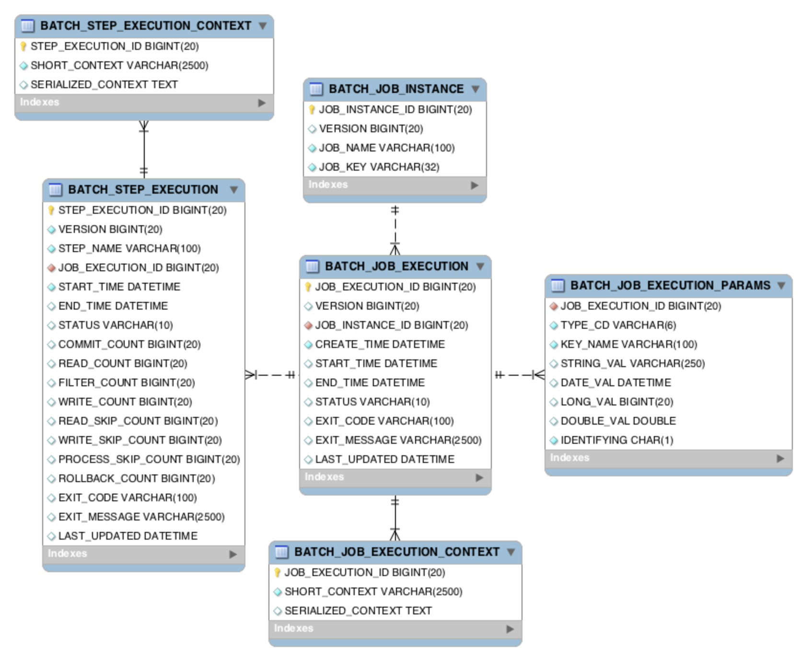
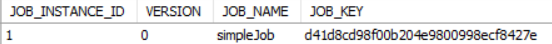
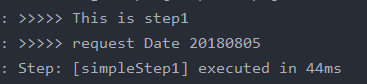
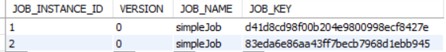
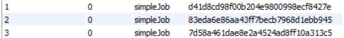
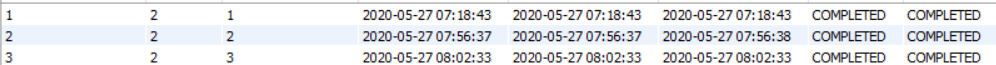
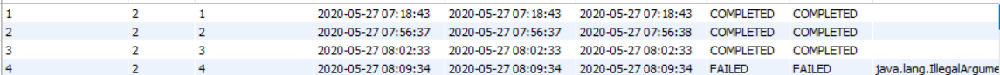
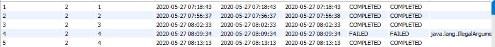
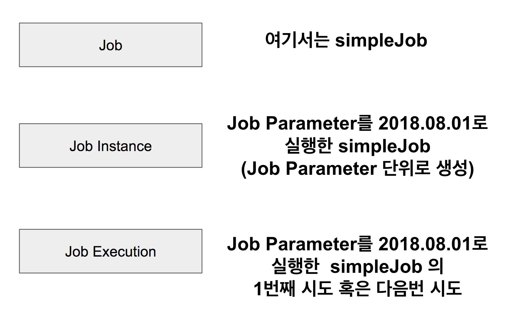

## 메타테이블

스프링 배치의 메타 테이블 역할에 대해 공부합니다.



### BATCH_JOB_INSTANCE

```sql
select * from batch_job_instance;
```

실행 결과는 다음과 같다.



- `JOB_INSTANCE_ID`
    - `BATCH_JOB_INSTANCE` 테이블의 PK
- `JOB_NAME`
    - 수행한 Batch Job Name

Chapter2에서 수행한 simpleJob을 확인할 수 있다.

BATCH_JOB_INSTANCE 테이블은 Job Parameter에 따라 생성되는 테이블이다. 여기에서 Job Parameter란 Spring Batch가 실행될 때 외부에서 받을 수 있는 파라미터이다. 특정 날짜를 Job Parameter로 넘기면 Spring Batch에서는 이를 이용해 조회/가공/입력 등 작업을 할 수 있다.

같은 Batch Job이라도 Job Parameter가 다르면 Batch_JOB_INSTANCE 에 기록되며, **Job Parameter가 같다면 기록되지 않는다.**

```java
@Bean
    public Job simpleJob(){
        return jobBuilderFactory.get("simpleJob")
                .start(simpleStep1(null))
                .build();
    }

    @Bean
    @JobScope
    public Step simpleStep1(@Value("#{jobParameters[requestDate]}") String requestDate) {
        return stepBuilderFactory.get("simpleStep1")
                .tasklet((contribution, chunkContext) -> {
                    log.info(">>>>> This is step1");
                    log.info(">>>>> request Date {}", requestDate);
                    return RepeatStatus.FINISHED;
                })
                .build();
    }
```

변경된 코드는 Job Parameter로 받은 값을 로그에 추가로 출력시킨다.

이제 Job Parameter를 넣어서 Batch를 실행하면 



로그가 정상적으로 찍힌다.

BATCH_JOB_INSTANCE를 살펴보면 다음과 같이 새로운 Job Instance가 추가된다는 것을 확인할 수 있다. 



같은 파라미터로 다시 한 번 IDE에서 Batch를 실행하면 Exception과 함께 수행이 되지 않는다.

`A job instance already exists and is complete for parameters={requestDate=20180805}. If you want to run this job again, change the parameters.`

다시 파라미터를 바꿀 경우 결과는 아래와 같다.



즉, 동일한 Job이라도 Job Parameter가 달라지면 그때마다 INSTANCE가 생성되며 동일한 Parameter는 여러개 존재할 수 없다.

### BATCH_JOB_EXECUTION



JOB_EXECUTION과 JOB_INSTANCE는 부모-자식 관계이다. EXECUTION은 부모인 JOB_INSTANCE가 성공/실패했던 모든 내역을 갖고 있다.

```java
@Slf4j // log 사용을 위한 lombok 어노테이션
@RequiredArgsConstructor // 생성자 DI를 위한 lombok 어노테이션
@Configuration
public class SimpleJobConfiguration {
    private final JobBuilderFactory jobBuilderFactory;
    private final StepBuilderFactory stepBuilderFactory;

    @Bean
    public Job simpleJob() {
        return jobBuilderFactory.get("simpleJob")
                .start(simpleStep1(null))
                .next(simpleStep2(null))
                .build();
    }

    @Bean
    @JobScope
    public Step simpleStep1(@Value("#{jobParameters[requestDate]}") String requestDate) {
        return stepBuilderFactory.get("simpleStep1")
                .tasklet((contribution, chunkContext) -> {
                    throw new IllegalArgumentException("step1에서 실패합니다.");
                })
                .build();
    }

    @Bean
    @JobScope
    public Step simpleStep2(@Value("#{jobParameters[requestDate]}") String requestDate) {
        return stepBuilderFactory.get("simpleStep2")
                .tasklet((contribution, chunkContext) -> {
                    log.info(">>>>> This is Step2");
                    log.info(">>>>> requestDate = {}", requestDate);
                    return RepeatStatus.FINISHED;
                })
                .build();
    }
}
```

위를 실행시키는 경우 발생된 Exception과 함께 Job은 실패한다.

이 경우 BATCH_JOB_EXECUTION은 다음과 같다.



4번째 JOB_INSTANCE를 FK로 가진 EXECUTION이 FAILED임을 확인 가능하다.

다시 `simpleStep1` 을 수정한 뒤 batch 수행 시 테이블은 다음과 같은 상태가된다.



여기에서 눈여겨 보아야 할 점은 INSTANCE FK가 동일하다는 것이다. `requestDate` 파라미터를 변경하지 않고 BATCH_JOB_INSTANCE가 2번 실행되었고 첫번째는 실패, 두번째는 성공했다는 것을 알 수 있다. 동일한 Job Parameter로 2번 실행했는데 같은 파라미터로 실행되었다는 에러가 발생하지 않았다. 다시말해 동일한 Job Parameter로 재수행이 안되는 경우는 **성공한 기록이 있을 때**뿐이다. 

### JOB, JOB_INSTANCE, JOB_EXECUTION

위의 두 테이블과 코드에서 구현한 Spring Batch Job의 관계는 아래와 같다.

