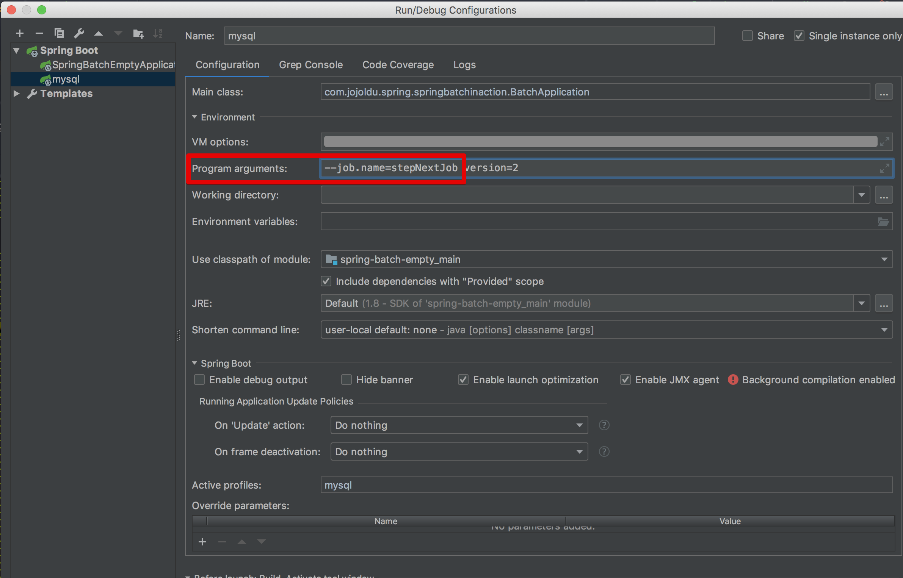
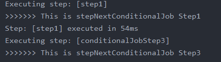
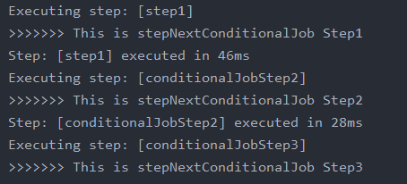
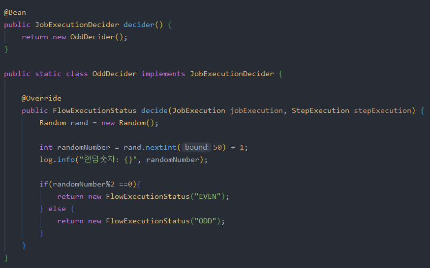

## Batch Job Flow

Step은 Job의 구성요소이자 실제 Batch 작업을 수행하는 역할을 한다.

실제로 Batch 비지니스 로직을 처리하는 `(ex: log.info())` 기능은 step에 구현되어 있다. Step은 Batch로 실제 처리하고자 하는 기능 및 설정을 모두 포함하는 장소이다.

Job 내부의 Step들간에 순서 혹은 처리 흐름을 제어할 필요가 있을 때 이를 관리하는 법을 알아본다.

### 4-1. Next

`StepNextJobConfiguration.java`

```java
@Slf4j
@Configuration
@RequiredArgsConstructor
public class StepNextJobConfiguration {
    private final JobBuilderFactory jobBuilderFactory;
    private final StepBuilderFactory stepBuilderFactory;

    @Bean
    public Job stepNextJop(){
        return jobBuilderFactory.get("stepNextJob")
                .start(step1())
                .next(step2())
                .next(step3())
                .build();
    }

    @Bean
    public Step step1(){
        return stepBuilderFactory.get("step1")
                .tasklet((contribution, chunkContext) -> {
                    log.info(">>>>>>> This is step1");
                    return RepeatStatus.FINISHED;
                })
                .build();
    }

    @Bean
    public Step step2(){
        return stepBuilderFactory.get("step2")
                .tasklet((contribution, chunkContext) -> {
                    log.info(">>>>>>> This is step2");
                    return RepeatStatus.FINISHED;
                })
                .build();
    }

    @Bean
    public Step step3(){
        return stepBuilderFactory.get("step3")
                .tasklet((contribution, chunkContext) -> {
                    log.info(">>>>>>> This is step3");
                    return RepeatStatus.FINISHED;
                })
                .build();
    }
}
```

### [Tip] 지정한 배치만 수행

`application.yml`

```yaml
spring.batch.job.names: ${job.name:NONE}
```

Spring Batch 실행시 Program arguments로 [job.name](http://job.name) 값이 넘어오면 해당 job만 실행하도록 정의한다. (중간의 콜론은 job.name이 있을 경우 그 값으로 할당, 없으면 `NONE`을 할당한다는 것을 의미)

spirng.batch.job.names에 `NONE`이 할당되는 경우 어떤 배치도 실행되지 않으며 이는 **값이 없을 때 모든 배치가 실행되지 않도록 하는 역할이다.**

위의 job.name을 배치 실행시 Program arguments로 넘기도록 IDE의 실행 환경에서 Job Parameter를 수정했던 Program arguments 항목에 아래와 같은 코드를 입력한다.

`--job.name=stepNextJob`



### 4-2. 조건별 흐름 제어

Next는 순차적으로 Step을 제어한다. 중요한 것은 앞의 step에서 오류 발생 시 다른 step들은 실행되지 못한다는 것이다. 하지만 상황에 따라 정상일 때는 Step B, 오류 발생시 Step C로 수행해야할때가 있다.

이런 경우를 위해 Spring Batch Job에서는 조건별 Step을 사용할 수 있다.

`StepNextConditionalJobConfiguration.java`

```java
@Slf4j
@Configuration
@RequiredArgsConstructor
public class StepNextConditionalJobConfiguration {
    private final JobBuilderFactory jobBuilderFactory;
    private final StepBuilderFactory stepBuilderFactory;

    @Bean
    public Job stepNextConditionalJob(){
        return jobBuilderFactory.get("stepNextConditionalJob")
                .start(conditionalStep1())
                    .on("FAILED") // failed일 경우
                    .to(conditionalStep3())// step3 이동
                    .on("*") // 이후 결과 관계없이
                    .end() // flow 종료
                .from(conditionalStep1())
                    .on("*") // failed 외의 모든 경우
                    .to(conditionalStep2()) // step2 이동
                    .next(conditionalStep3()) // 정상종료시 step3 이동
                    .on("*") // 결과 관계 없이
                    .end() // step3 이동하면 flow 종료
                .end()
                .build();
    }

    @Bean
    public Step conditionalStep1(){
        return stepBuilderFactory.get("step1")
                .tasklet((contribution, chunkContext) -> {
                    log.info(">>>>>>> This is stepNextConditionalJob Step1");
                    contribution.setExitStatus(ExitStatus.FAILED);

                    return RepeatStatus.FINISHED;
                })
                .build();
    }

    @Bean
    public Step conditionalStep2(){
        return stepBuilderFactory.get("conditionalJobStep2")
                .tasklet((contribution, chunkContext) -> {
                    log.info(">>>>>>> This is stepNextConditionalJob Step2");
                    return RepeatStatus.FINISHED;
                })
                .build();
    }

    @Bean
    public Step conditionalStep3(){
        return stepBuilderFactory.get("conditionalJobStep3")
                .tasklet((contribution, chunkContext) -> {
                    log.info(">>>>>>> This is stepNextConditionalJob Step3");
                    return RepeatStatus.FINISHED;
                })
                .build();
    }
}
```

- `on()`
    - 캐치할 ExitStatus 지정
    - * 일 경우 모든 ExitStatus 지정
- `to()`
    - 다음으로 이동할 Step 지정
- `from()`
    - 이벤트리스너 역할
    - 상태값을 보고 일치하는 상태라면 `to()` 에 포함된 `step` 호출
    - step1의 이벤트 캐치가 FAILED로 되있는 상태에서 추가 이벤트 캐치를 위해서는 from을 써야한다
- `end()`
    - end는 FlowBuilder를 반환하는 end와 FlowBuilder를 종료하는 end 2개가 있음
    - `on("*")` 뒤의 end는 FlowBuilder를 반환하는 end
    - `build()` 앞의 end는 FlowBuilder를 종료하는 end
    - FlowBuilder를 반환하는 end 사용시 계속해서 from을 이어갈 수 있음

여기서 on이 캐치하는 상태값이 BatchStatus가 아닌 ExitStatus라는 점을 고려해야한다. 상태값 조정은 ExitStatus를 통해 진행한다.



현재 상태 결과



ExitStatus.FAILED 없앤 뒤 결과

### [Tip] Batch Status vs Exit Status

BatchStatus → **Job 또는 Step 실행의 결과를 Spring에서 기록**할 때 사용하는 Enum이며 COMPLETED, STARTING, STARTED, STOPPING, STOPPED, FAILED, ABANDONED, UNKNOWN 등이 존재

ExitStatus → **Step의 실행 후 상태,** 기본적으로 ExitStatus의 exitCode는 Step의 BatchStatus와 동일하다.

#### 본인의 커스텀 exitCode가 필요하다면?

```java
.start(step1())
    .on("FAILED")
    .end()
.from(step1())
    .on("COMPLETED WITH SKIPS")
    .to(errorPrint1())
    .end()
.from(step1())
    .on("*")
    .to(step2())
    .end()
```

위의 실행결과는 다음과 같이 3가지가 될 수 있다.

- step1 실패 → Job 실패
- step1 성공 → step2 수행
- step1 완료 → "completed with~~" 코드로 종료

`COMPLETED WITH SKIPS`는 ExitStatus에 없는 코드이다. 원하는대로 처리하기 위해서는 해당 exitCode를 반환하는 별도 로직이 필요하다.

```java
public class SkipCheckingListener extends StepExecutionListenerSupport {

    public ExitStatus afterStep(StepExecution stepExecution) {
        String exitCode = stepExecution.getExitStatus().getExitCode();
        if (!exitCode.equals(ExitStatus.FAILED.getExitCode()) && 
              stepExecution.getSkipCount() > 0) {
            return new ExitStatus("COMPLETED WITH SKIPS");
        }
        else {
            return null;
        }
    }
}
```

StepExecutionListener는 Step이 성공적으로 수행되었는지 확인하며, StepExecution의 skip 횟수가 0보다 클 경우 `**COMPLETED WITH SKIPS의 exitCode를 갖는 ExitStatus를 반환**한다.`

### 4-3. Decide

위에서는 Step의 결과에 따라 서로 다른 Step으로 이동하는 방법을 알아봤다. 여기에는 2가지 문제가 있다.

- Step이 담당하는 역할이 2개 이상이 됨
    - 실제 해당 Step 로직 외에도 분기처리를 위한 ExitStatus 조작 필요
- 다양한 분기 로직 처리의 어려움
    - ExitStatus를 커스텀하게 고치기 위해선 Listener를 생성하고 Job Flow에 등로하는 등 번거로움 존재

이에 따라 명확하게 Step들간 Flow 분기만 담당하며 다양한 분기처리가 가능한 타입이 필요하다. Spring Batch에서는 Step들 Flow 속 **분기만 담당하는 타입**이 있다. 이를 JobExecutionDecider라 한다.

`DeciderJobConfiguration`

```java
@Slf4j
@Configuration
@RequiredArgsConstructor
public class DeciderJobConfiguration {
    private final JobBuilderFactory jobBuilderFactory;
    private final StepBuilderFactory stepBuilderFactory;

    @Bean
    public Job deciderJob(){
        return jobBuilderFactory.get("deciderJob")
                .start(startStep())
                .next(decider())
                .from(decider())
                    .on("ODD")
                    .to(oddStep())
                .from(decider())
                    .on("EVEN")
                    .to(evenStep())
                .end()
                .build();
    }

    @Bean
    public Step startStep(){
        return stepBuilderFactory.get("startStep")
                .tasklet((contribution, chunkContext) -> {
                    log.info(">>>>> Start!");
                    return RepeatStatus.FINISHED;
                })
                .build();
    }

    @Bean
    public Step evenStep(){
        return stepBuilderFactory.get("evenStep")
                .tasklet((contribution, chunkContext) -> {
                    log.info(">>>> 짝수입니다.");
                    return RepeatStatus.FINISHED;
                })
                .build();
    }

    @Bean
    public Step oddStep(){
        return stepBuilderFactory.get("oddStep")
                .tasklet((contribution, chunkContext) -> {
                    log.info(">>>> 홀수입니다.");
                    return RepeatStatus.FINISHED;
                })
                .build();
    }

    @Bean
    public JobExecutionDecider decider() {
        return new OddDecider();
    }

    public static class OddDecider implements JobExecutionDecider {

        @Override
        public FlowExecutionStatus decide(JobExecution jobExecution, StepExecution stepExecution) {
            Random rand = new Random();

            int randomNumber = rand.nextInt(50) + 1;
            log.info("랜덤숫자: {}", randomNumber);

            if(randomNumber%2 ==0){
                return new FlowExecutionStatus("EVEN");
            } else {
                return new FlowExecutionStatus("ODD");
            }
        }
    }
}
```

Batch Flow

1. startStep → oddDecider에서 홀수인지 짝수인지 구분
2. oddStep or evenStep 진행
- `start()`
    - Job Flow의 첫번째 Step을 시작
- `next()`
    - `startStep` 이후에 `decider`를 실행
- `from()`
    - 이벤트 리스너 역할
    - decider의 상태값을 보고 일치하는 상태라면 `to()`에 포함된 `step` 를 호출

이는 분기 로직을 Step에서 담당하지 않고 OddDecider가 전담하여 역할과 책임을 분리시킨다.

#### Decider 구현체



JobExecutionDecider 인터페이스를 구현한 구현체이다.

이는 랜덤하게 숫자를 생성하며 홀수/짝수 여부에 따라 서로 다른 상태를 반환한다. 여기서 주의해야할 점은 Step으로 처리하는 것이 아니기 때문에 `ExitStatus`가 아닌 `FlowExecutionStatus`로 상태를 관리한다.

이를 통해 손십게 상태를 생성하여 반환하며 이 상태는 `from().on()`에서 사용된다.