## Chunk지향 처리

### 6-1. Chunk?

Spring Batch에서의 Chunk란 데이터 덩어리로 작업할 때 각 커밋 사이에 처리되는 row수이다. **한 번에 하나씩 데이터를 읽어 Chunk 덩어리를 만든 뒤**, Chunk 단위 트랜잭션을 다루는 것을 의미한다. 

Chunk 단위로 트랜잭션을 수행하기 때문에 실패할 경우 해당 Chunk 만큼만 롤백이 되고, 이전에 커밋된 트랜잭션 범위까지는 반영이 된다.

Chunk 지향 처리는 결국 Chunk 단위로 데이터를 처리한다는 의미이기에 그림으로 표현시 다음과 같다.

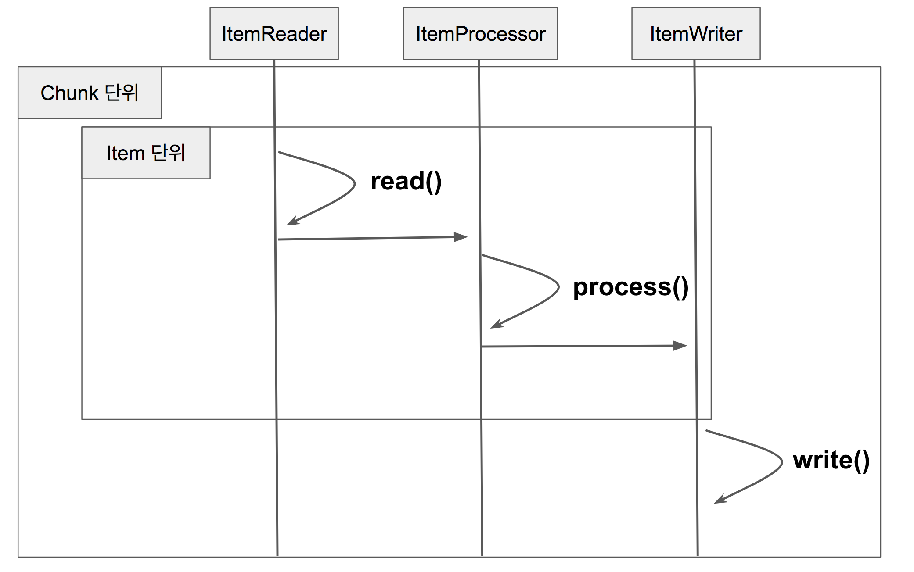

- Reader에서 데이터 읽기
- Processor에서 가공
- 가공 데이터들을 별도 공간에 모은 뒤, Chunk 단위만큼 쌓이면 Writer에 전달 후 이를 일괄 저장

Reader와 Processor는 1건씩 다뤄지고 Writer에선 Chunk 단위 처리가 진행된다.

```java
for(int i=0; i<totalSize; i+=chunkSize){ // chunkSize 단위로 묶어서 처리
    List items = new Arraylist();
    for(int j = 0; j < chunkSize; j++){
        Object item = itemReader.read()
        Object processedItem = itemProcessor.process(item);
        items.add(processedItem);
    }
    itemWriter.write(items);
}
```

코드를 살펴보면 **chunkSize** 단위로 처리된다는 것을 알 수 있다. 이제 Chunk 지향 처리를 실제 Spring Batch 내부 코드와 알아본다.

### 6-2. ChunkOrientedTasklet

Chunk 지향 처리의 전체 로직을 다루는 것은 `CunkOrientedTasklet` 클래스이다. 특히 이중 중요한 것은 execute() 코드이다. Chunk 단위 처리의 전체 코드는 이곳에 있다.

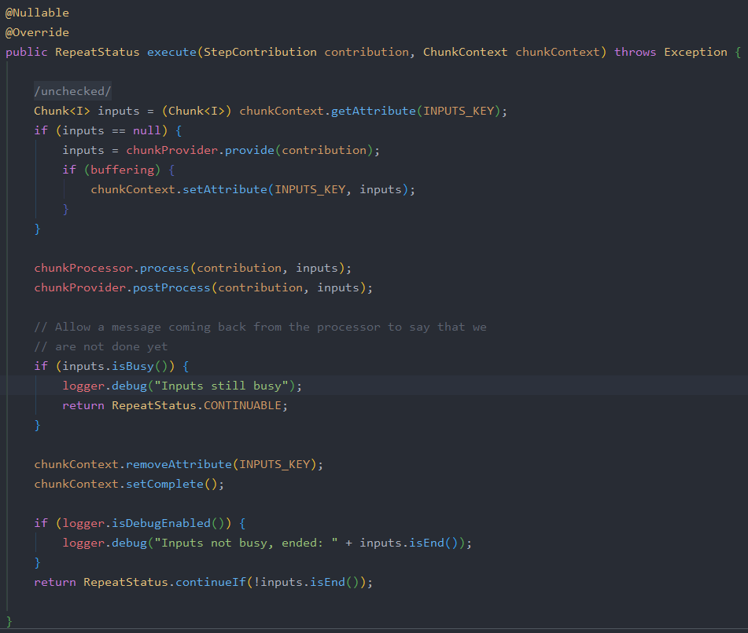

- `chunkProvider.provide()`는 Reader에서 Chunk size만큼 데이터를 가져온다.
- `chunkProcessor.process()`에서 Reader로 받은 데이터를 가공(Processor) 및 저장(Writer)한다.

데이터를 가져오는 `chunkProvider.provide()`를 가보면 데이터를 어떻게 가져오는지 알 수 있다. (`SimpleChunkProvider` 구현체 참조)

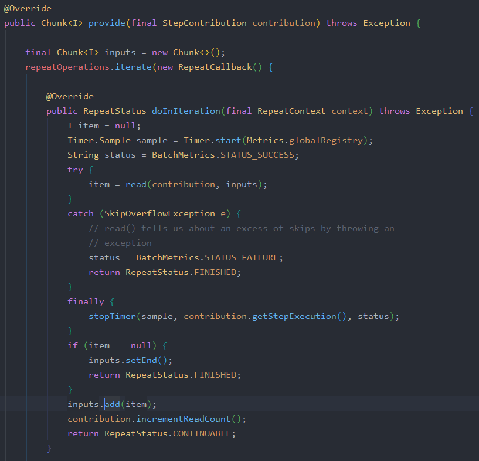

`input`이 Chunksize만큼 쌓일때까지 `read()`를 호출한다.

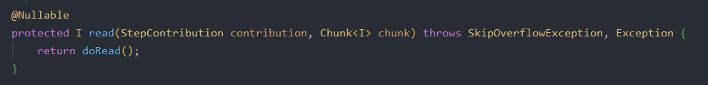

`read()`는 내부적으로 `ItemReader.read`를 호출한다.

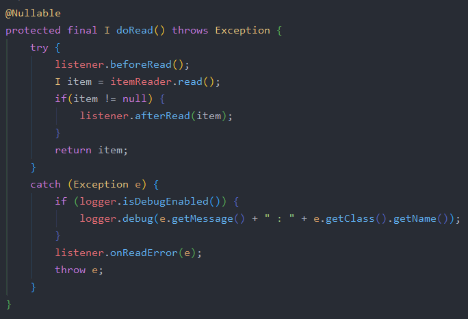

즉, `ItemReader.read()`에서 1건씩 데이터를 조회해 Chunk size만큼 데이터를 쌓는 것이 provide()가 하는 일이다.

### 6-3. SimpleChunkProcessor

 ChunkProcessor의 구현체 중 기본으로 사용되는 `SimpleChunkProcessor`를 살펴본다.

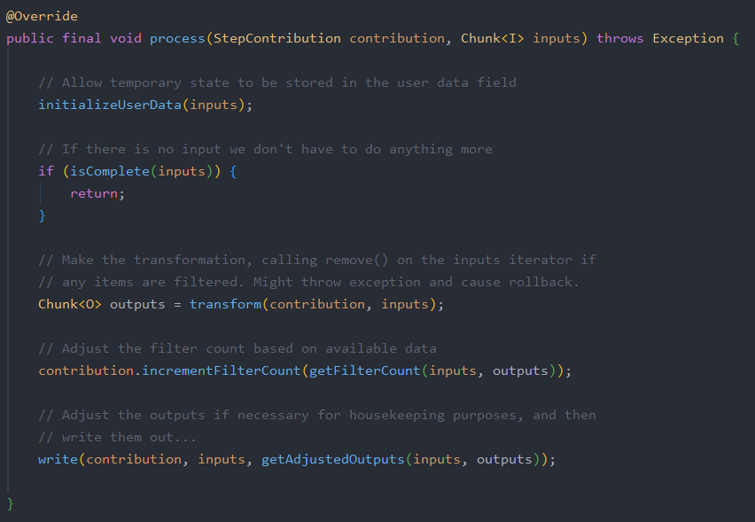

위는 처리를 담당하는 핵심로직인 `process()`이다.

- `Chunk<I> Inputs`를 파라미터로 받는다.
    - 이는 앞서 `chunkProvider.provide()`에서 받은 ChunkSize만큼 쌓인 item이다.
- `transform()`에서는 전달받은 `inputs`를 `doProcess()`로 전달하고 변환값을 받는다.
- `transform()`을 통해 가공된 대량의 데이터는 `write()`를 통해 일괄 저장된다.
    - `write()`는 저장이 될수도 있고, 외부 API로 전송할 수도 있다.
    - 이는 개발자의 구현에따라 달라짐

`transform()`은 반복문을 통해 `doProcess()`를 호출한다. 해당 메소드는 ItemProcessor의 `process()`를 사용한다.

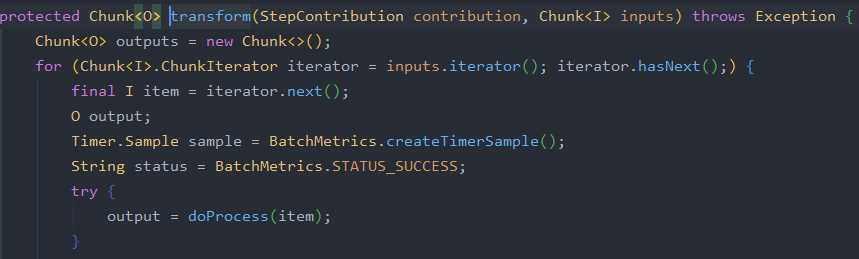

`doProcess()`를 처리하는데 만약 ItemProcessor가 없다면 item을 그대로 반환하고, 있다면 ItemProcessor의 `process()`로 가공하여 반환한다.

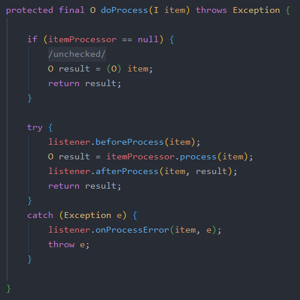

이렇게 가공된 데이터들은 SimpleChunkProcessor의 `doWriter()`를 호출하여 일괄 처리한다.

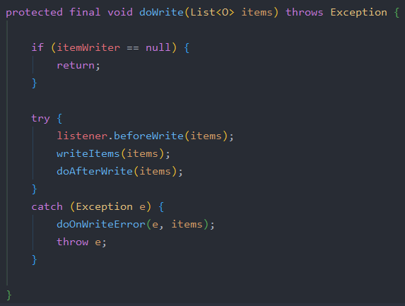

### 6-4. Page Size vs Chunk Size

Page Size와 Chunk Size는 서로 의미하는 바가 다르다.

Chunk Size는 **한번에 처리될 트랜잭션 단위**이며 Page Size는 **한번에 조회할 Item의 양**을 얘기한다.

이 2개가 어떻게 다른지 실제 코드를 살펴본다.

다음은 PagingItemReader의 부모 클래스인 `AbstractItemCountingItemStreamItemReader`의 `read()`메소드이다.

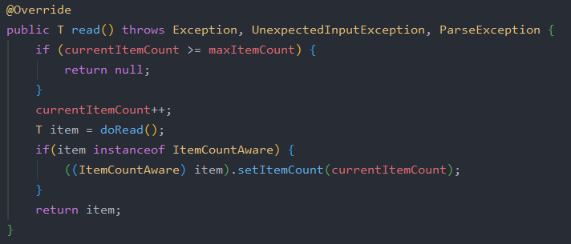

읽어올 데이터가 있다면 `doRead()`를 호출한다.

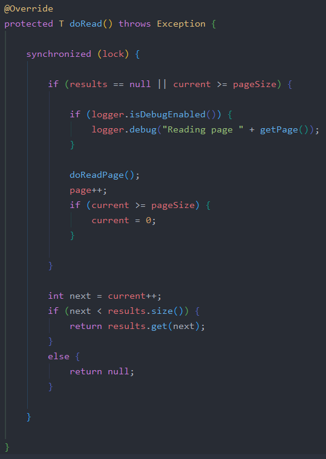

`doRead()`에서는 현재 읽어올 데이터가 없거나, Page Size를 초과한 경우 `doReadPage()`를 호출한다. 

- 읽어올 데이터가 없는 경우는 read가 처음 시작할 때이다.
- Page Size를 초과하는 경우는 Page Size가 10인데, 읽어야할 데이터가 11번째 데이터인 경우이다. 이런 경우 Page Size를 초과하여 `doReadPage()`를 호출한다고 보면 된다.

즉, **Page 단위로 조회**하는 것이다.

`doReadPage()`부터는 하위 구현 클래스에서 각자의 방식으로 페이징 쿼리를 생성한다. 여기에서는 보편적으로 사용되는 JpaPagingItemReader 코드를 살펴보도록 한다.

다음은 JpaPagingItemReader의 `doReadPage()`코드의 일부이다.

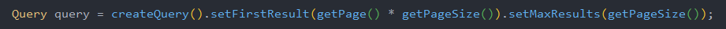

Reader에서 지정한 Page Size만큼 `offset`, `limit`값을 지정하여 페이징 쿼리를 생성하고 (createQuery), 사용한다. (query.getResultList)

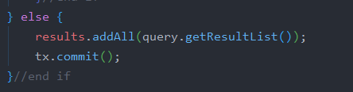

이 결과는 `result`에 저장된다.

즉, Page Size는 페이징 쿼리에서 Page의 Size를 지정하기 위한 값이다.

만약 2개 값이 다르다면? ex → PageSize가 10이고, ChunkSize가 50인 경우

ItemReader에서 Page 조회가 5번 일어나면 1번의 트랜잭션이 발생하여 Chunk가 처리된다. 이는 트랜잭션 한 번 처리를 위해 5번의 쿼리 조회가 발생하게 되며 성능 이슈가 발생할 수 있다.

2개 값은 의미하는 바가 다르지만 이런 이슈로 2개값을 일치시키는 것이 보편적으로 좋은 방법이다.