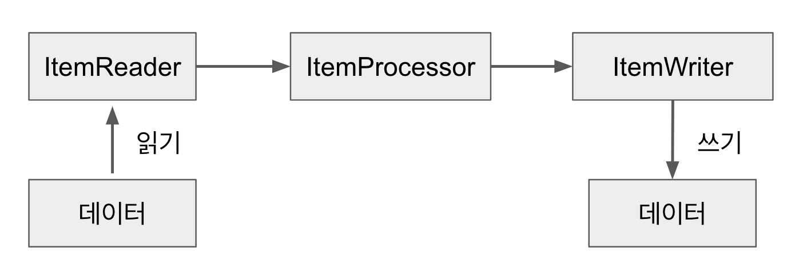
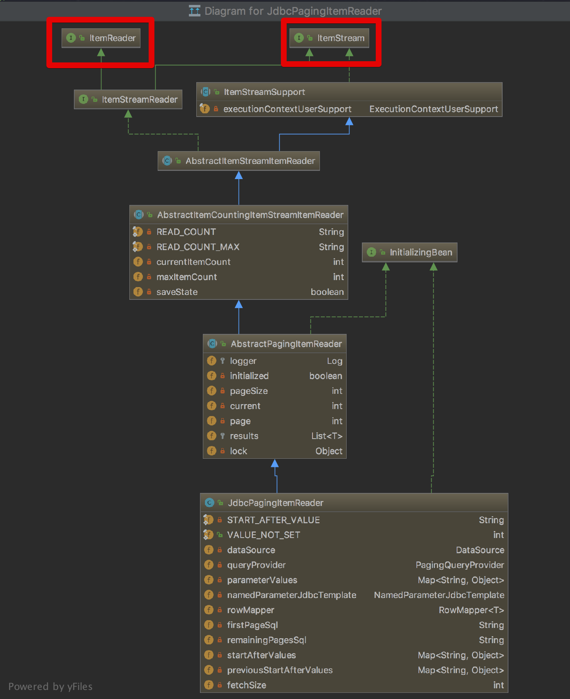
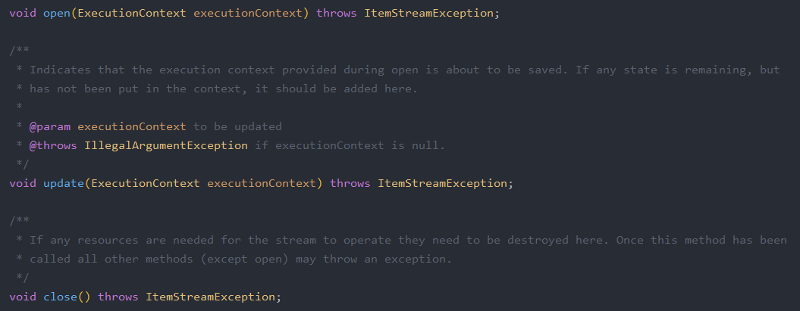
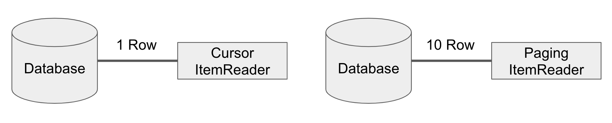
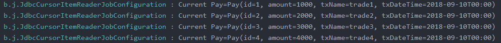
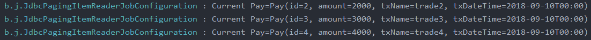
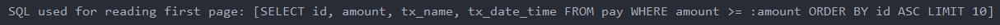

## ItemReader

Step은 Tasklet 단위로 처리되고, Tasklet 중 ChunkOrientedTasklet을 통해 Chunk를 처리하며 이를 구성하는 3요소로 ItemReader, ItemWriter, ItemProcessor가 있음을 배웠다.

즉, ItemReader & ItemWriter & ItemProcessor의 묶음 또한 ChunkOrientedTasklet으로부터 관리되기 때문에 Tasklet이다.

### 7-1. ItemReader?

Spring Batch의 Chunk Tasklet은 아래 과정을 통해 진행된다.



Spring Batch의 ItemReader는 데이터를 읽어들인다. 이는 DB 뿐만이 아니라 File, XML, JSON 등 다른 데이터 소스를 배치 처리 입력으로 사용 가능하다. 또한, JMS와 같은 다른 유형의 데이터 소스도 지원한다.

이외에도 Spring Batch에서 지원하지 않는 Reader가 필요한 경우 직접 Reader를 만들수도 있다. Spring Batch는 이를 위해 Custom Reader 구현체를 만들기 쉽게 제공하고 있다. 정리하면 Spring Batch의 Reader에서 읽어올 수 있는 데이터 유형은 다음과 같다.

- 입력 데이터
- 파일
- DB
- JMS등 다른 소스
- 본인의 커스텀 Reader

이제 ItemReader의 구현체들을 살펴보도록 한다. 여기에는 대표적 구현체인 JdbcPagingItemReader가 있다. 해당 클래스 계층 구조는 아래와 같다.



이는 ItemReader 외에 ItemStream 인터페이스도 같이 구현하고 있다.

ItemReader는 인터페이스에 `read()`만 가지고 있다. 그렇다면 ItemStream은 무슨 역할을 할까? 이는 주기적으로 **상태를 저장하고 오류 발생시 해당 상태에서 복원하기 위한 마커 인터페이스**이다. 

즉, 배치 프로세스의 실행 컨텍스트와 연계해서 **ItemReader의 상태를 저장하고 실패한 곳에서 다시 실행할 수 있게 해주는 역할**을 한다.


3개의 메소드는 다음과 같은 역할을 수행한다.

- `open()`, `close()`는 스트림을 열고 닫는다
- `update()`를 사용하면 Batch 처리의 상태를 업데이트 할 수 있다.

개발자는 ItemReader와 ItemStream 인터페이스를 직접 구현해서 원하는 형태의 ItemReader를 만들 수 있다.

다만 Spring Batch에서 대부분의 데이터 형태는 ItemReader로 이미 제공하고 있기 때문에 커스텀한 ItemReader를 구현할 일은 많이 없을 것이다.

> 단, 조회 프레임워크가 Querydsl, Jooq라면 직접 구현해야할 수 있다. JPA 영속성 컨텍스트 지원이 되지 않아 Hibernate ItemReader를 이용하여  Reader 구현체를 직접 구현해야 한다.

이제 구현체를 알아본다. 여기에서는 현업에서 자주 사용되는 DB 구현체들만 다룬다.

### 7-2. Database Reader

Spring 프레임워크의 강점 중 하나는 개발자가 비즈니스 로직에만 집중할 수 있도록 JDBC와 같은 문제점을 추상화한 것이다.

Spring Batch 개발자들은 Spring 프레임워크의 JDBC 기능을 확장했다. 일반적으로 배치 작업은 많은 양의 데이터를 처리해야 한다. (실시간 처리가 어려운 대용량 데이터나 대규모 데이터일 경우 배치 어플리케이션을 사용하기 때문)

수백만개의 데이터를 조회하는 쿼리가 있는 경우 해당 데이터를 모두 한 번에 불러오길 원하는 개발자는 없다.

그러나 Spring의 JdbcTemplate은 분할 처리를 지원하지 않고 쿼리 결과를 그대로 반환하기에 개발자가 직접 `limit`, `offset`을 사용하는 등의 작업이 필요하다.

Spring Batch는 이런 문제를 해결하기 위해 2개의 Reader 타입을 지원한다.

#### Cursor

Cursor는 실제로 JDBC ResultSet의 기본 기능이다. ResultSet이 open될 때마다 `next()`메소드가 호출되어 DB의 데이터가 반환된다. 이를통해 필요에 따라 DB에서 데이터를 Streaming할 수 있다.

#### Paging

Paging은 좀 더 많은 작업을 필요로 한다. Paging개념은 페이지라는 Chunk로 DB에서 데이터를 검색한다는 것이다.  즉 페이지단위로 한번에 데이터를 조회해오는 방식이다.

둘을 비교하면 아래와 같다.



Cursor 방식은 DB와 커넥션을 맺은 후, Cursor를 한칸씩 옮기며 지속적으로 데이터를 가져온다. 반면 Paging 방식은 한번에 지정한 PageSize만큼 데이터를 가져온다.

2개 방식의 구현체는 다음과 같다.

- Cursor 기반 ItemReader 구현체
    - JdbcCursorItemReader
    - HibernateCursorItemReader
    - StoredProcedureItemReader
- Paging 기반 ItemReader 구현체
    - JdbcPagingItemReader
    - HibernatePagingItemReader
    - JpaPagingItemReader

예제에서는 JdbcCursorItemReader와 JdbcPagingItemReader를 소개한다.

### 7-3. CursorItemReader

CursorItemReader는 Paging과 다르게 Streaming으로 데이터를 처리한다. 즉, DB와 어플리케이션 사이 통로를 연결하고 데이터를 하나씩 빨아들인다 생각하면 된다. JSP나 Servlet으로 게시판을 작성해보면 `Resultset`을 사용해서 `next()`로 하나씩 데이터를 가져오는 것을 기억하면 된다.

### 7-3-1. JdbcCursorItemReader

JdbcCursorItemReader는 Cursor 기반의 JDBC Reader 구현체이다. 아래 샘플 코드를 살펴보도록 한다.

`Pay.class`

```java
@ToString
@Getter
@Setter
@NoArgsConstructor
@Entity
public class Pay {
    private static final DateTimeFormatter FORMATTER = DateTimeFormatter.ofPattern("yyyy-MM-dd hh:mm:ss");

    @Id
    @GeneratedValue(strategy = GenerationType.IDENTITY)
    private Long id;
    private Long amount;
    private String txName;
    private LocalDateTime txDateTime;

    public Pay(Long amount, String txName, String txDateTime) {
        this.amount = amount;
        this.txName = txName;
        this.txDateTime = LocalDateTime.parse(txDateTime, FORMATTER);
    }

    public Pay(Long id, Long amount, String txName, String txDateTime) {
        this.id = id;
        this.amount = amount;
        this.txName = txName;
        this.txDateTime = LocalDateTime.parse(txDateTime, FORMATTER);
    }
}
```

`JdbcCursorItemReaderJobConfiguration.class`

```java
@Slf4j
@RequiredArgsConstructor
@Configuration
public class JdbcCursorItemReaderJobConfiguration {

    private final JobBuilderFactory jobBuilderFactory;
    private final StepBuilderFactory stepBuilderFactory;
    private final DataSource dataSource; // DataSource DI

    private static final int chunkSize = 10;

    @Bean
    public Job jdbcCursorItemReaderJob() {
        return jobBuilderFactory.get("jdbcCursorItemReaderJob")
                .start(jdbcCursorItemReaderStep())
                .build();
    }

    @Bean
    public Step jdbcCursorItemReaderStep() {
        return stepBuilderFactory.get("jdbcCursorItemReaderStep")
                .<Pay, Pay>chunk(chunkSize)
                .reader(jdbcCursorItemReader())
                .writer(jdbcCursorItemWriter())
                .build();
    }

    @Bean
    public JdbcCursorItemReader<Pay> jdbcCursorItemReader() {
        return new JdbcCursorItemReaderBuilder<Pay>()
                .fetchSize(chunkSize)
                .dataSource(dataSource)
                .rowMapper(new BeanPropertyRowMapper<>(Pay.class))
                .sql("SELECT id, amount, tx_name, tx_date_time FROM pay")
                .name("jdbcCursorItemReader")
                .build();
    }

    private ItemWriter<Pay> jdbcCursorItemWriter() {
        return list -> {
            for (Pay pay: list) {
                log.info("Current Pay={}", pay);
            }
        };
    }
}
```

코드는 아래와 같다.

reader는 Tasklet이 아니기에 reader만으로는 수행될 수 없고, 간단한 Writer를 하나 추가한다. processor는 필수가 아니기 때문에 여기서는 생략한다.

jdbcCursorItemReader의 설정값들은 다음과 같은 역할을 한다.

- chunk
    - `<Pay, Pay>`에서 첫번째 Pay는 Reader에서 반환할 타입이며, 두번째 Pay는 Writer에 파라미터로 넘어올 타입을 이야기한다.
    - `chunkSize`로 인자값을 넣은 경우는 Reader & Writer가 묶일 Chunk 트랜잭션 범위이다.
- fetchSize
    - DB에서 한번에 가져올 데이터 양을 나타낸다.
    - Paging과는 다른 것이, Paging은 실제 쿼리를 `limit`, `offset`을 이용해서 분할 처리하는 반면, Cursor는 쿼리는 분할 처리 없이 실행되나 내부적으로 가져오는 데이터는 FetchSize만큼 가져와 `read()`를 통해서 하나씩 가져온다.
    - dataSource
        - DB에 접근하기 위해 사용할 Datasource 객체를 할당한다.
    - rowMapper
        - 쿼리 결과를 java 인스턴스로 매핑하기 위한 Mapper이다.
        - 커스텀하게 생성해서 사용할 수도 있지만, 이 경우 매번 Mapper 클래스를 생성해야하기 때문에 Spring에서 공식 지원하는 `BeanPropertyRowMapper.class`를 많이 사용한다.
    - sql
        - Reader로 사용할 쿼리문을 사용하면 된다.
    - name
        - reader의 이름을 지정한다.
        - Bean이름이 아니며 Spring Batch의 ExecutionContext에서 저장되어질 이름이다.

`JdbcTemplate`과 인터페이스가 동일하기 때문에 JdbcItemReader는 비교적 사용하기 쉬운 모습이다. 위의 예제를 `jdbcTemplate`로 구현하면 아래처럼 된다.

```java
JdbcTemplate jdbcTemplate = new JdbcTemplate(dataSource);
List<Pay> payList = 
	jdbcTemplate.query("SELECT id, amount, tx_name, tx_date_time FROM pay", 
											new BeanPropertyRowMapper<>(Pay.class));
```

거의 차이가 없어 보이지만 ItemReader의 가장 큰 장점은 데이터를 Streaming할 수 있다는 것이다. `read()`메소드는 데이터를 하나씩 가져와 ItemWriter로 데이터를 전달하고, 다음 데이터를 다시 가져온다.

이를 통해 reader & processor & writer가 Chunk 단위로 수행되고 주기적으로 Commit 된다. 이는 고성능 배치 처리에서는 핵심이다.

먼저 아래 쿼리를 실행한다.

```sql
create table pay (
  id         bigint not null auto_increment,
  amount     bigint,
  tx_name     varchar(255),
  tx_date_time datetime,
  primary key (id)
) engine = InnoDB;

insert into pay (amount, tx_name, tx_date_time) VALUES (1000, 'trade1', '2018-09-10 00:00:00');
insert into pay (amount, tx_name, tx_date_time) VALUES (2000, 'trade2', '2018-09-10 00:00:00');
insert into pay (amount, tx_name, tx_date_time) VALUES (3000, 'trade3', '2018-09-10 00:00:00');
insert into pay (amount, tx_name, tx_date_time) VALUES (4000, 'trade4', '2018-09-10 00:00:00');
```

배치를 실행해보도록 한다.

먼저 Reader에서 쿼리의 생성과 실행을 확인하기 위해 Log Level을 변경한다.

테스트 및 메인의 application.yml에 아래 코드를 추가한다.

```yaml
logging.level.org.springframework.batch: DEBUG
```


데이터가 제대로 조회되어 Writer에 명시한대로 데이터가 Print 되는 것을 확인할 수 있다.

### CursorItemReader의 주의사항

CursorItemReader를 사용할 때는 Database와 SocketTimeout을 충분히 큰 값으로 설정해야만 한다.

Cursor는 **하나의 Connection으로 Batch가 끝날때까지 사용**되기때문에 Batch가 끝나기전에 Database와 어플리케이션의 Connection이 먼저 끊어질 수 있다.

그래서 Batch 수행 시간이 오래 걸리는 경우 PagingItemReader를 사용하는게 낫다. Paging의 경우 한 페이지를 읽어올 때마다 Connection을 맺고 끊기 때문에 아무리 많은 데이터라도 타임아웃과 부하 없이 수행할 수 있다.

### 7-4. PagingItemReader

Database Cursor를 사용하는 대신 여러 쿼리를 실행하여 각 쿼리가 결과의 일부를 가져오는 방법도 있다. 이런 처리 방법을 Paging이라고 한다. 페이징을 한다는 것은 각 쿼리에 시작 행 번호(`offset`)과 페이지에서 반환할 행 수 (`limit`)을 지정해야함을 의미한다. 

Spring Batch에서는 `offset`과 `limit`을 **PageSize에 맞게 자동으로 생성해준다.** 다만 각 쿼리는 개별적으로 실행한다는 점을 유의해야한다. 각 페이지마다 새로운 쿼리를 실행하므로 **페이징시 결과를 정렬하는 것이 중요**하다. 순서가 보장될 수 있도록 order by가 권장된다.

### 7-4-1. JdbcPagingItemReader

JdbcPagingItemReader는 JdbcCursorItemReader와 같은 JdbcTemplate 인터페이스를 이용한 PagingItemReader 이다.

`JdbcPagingItemReaderJobConfiguration.class`

```java
@Slf4j
@RequiredArgsConstructor
@Configuration
public class JdbcPagingItemReaderJobConfiguration {

    private final JobBuilderFactory jㅔㅁㄱobBuilderFactory;
    private final StepBuilderFactory stepBuilderFactory;
    private final DataSource dataSource; // DataSource DI

    private static final int chunkSize = 10;

    @Bean
    public Job jdbcPagingItemReaderJob() throws Exception {
        return jobBuilderFactory.get("jdbcPagingItemReaderJob")
                .start(jdbcPagingItemReaderStep())
                .build();
    }

    @Bean
    public Step jdbcPagingItemReaderStep() throws Exception {
        return stepBuilderFactory.get("jdbcPagingItemReaderStep")
                .<Pay, Pay>chunk(chunkSize)
                .reader(jdbcPagingItemReader())
                .writer(jdbcPagingItemWriter())
                .build();
    }

    @Bean
    public JdbcPagingItemReader<Pay> jdbcPagingItemReader() throws Exception {
        Map<String, Object> parameterValues = new HashMap<>();
        parameterValues.put("amount", 2000);

        return new JdbcPagingItemReaderBuilder<Pay>()
                .pageSize(chunkSize)
                .fetchSize(chunkSize)
                .dataSource(dataSource)
                .rowMapper(new BeanPropertyRowMapper<>(Pay.class))
                .queryProvider(createQueryProvider())
                .parameterValues(parameterValues)
                .name("jdbcPagingItemReader")
                .build();
    }

    private ItemWriter<Pay> jdbcPagingItemWriter() {
        return list -> {
            for (Pay pay: list) {
                log.info("Current Pay={}", pay);
            }
        };
    }

    @Bean
    public PagingQueryProvider createQueryProvider() throws Exception {
        SqlPagingQueryProviderFactoryBean queryProvider = new SqlPagingQueryProviderFactoryBean();
        queryProvider.setDataSource(dataSource); // Database에 맞는 PagingQueryProvider를 선택하기 위해 
        queryProvider.setSelectClause("id, amount, tx_name, tx_date_time");
        queryProvider.setFromClause("from pay");
        queryProvider.setWhereClause("where amount >= :amount");

        Map<String, Order> sortKeys = new HashMap<>(1);
        sortKeys.put("id", Order.ASCENDING);

        queryProvider.setSortKeys(sortKeys);

        return queryProvider.getObject();
    }
}
```

코드에서는 쿼리 `createQueryProvider()`가 있다. JdbcCursorItemReader를 사용할 때는 단순히 `String`타입으로 쿼리를 생성했지만, PagingItemReader에서는 PagingQueryProvider를 통해 쿼리를 생성한다. 이렇게 하는데는 큰 이유가 있다.

**각 DB에는 Paging을 지원하는 자체적인 전략들이 존재한다.**

따라서 Spring Batch는 각 DB의 Paging 전략을 맞춰서 구현되어야만 한다. 이를 위해 각 DB에 맞는 다양한 Provider들이 존재하지만 DB마다 Provider 코드를 바꿔야하니 불편함이 생긴다.

ex) 로컬은 H2, 개발/운영은 MySQL인 경우 Provider를 고정시킬 수 없음

따라서 Spring Batch에서는 SqlPagingQueryProviderFactoryBean을 통해 Datasource 설정값을 보고 위 이미지에서 작성된 Provider중 하나를 자동으로 선택하도록 한다.

이렇게 하는 경우 코드 변경 사항이 적어서 Spring Batch에서 공식 지원하는 방법이다.

이외의 다른 설정 값은 JdbcCursorItemReader와 크게 다르지 않다.

- parameterValues
    - 쿼리에 대한 매개 변수 값의 Map을 지정
    - `queryProvider.setWhereClause`를 보면 어떻게 변수를 사용하는지 자세히 알 수 있다.
    - where 절에서 선언된 파라미터 변수명과 parameterValues에서 선언된 파라미터 변수명이 일치해야만 한다.

Batch를 실행시켜 본다.


정상적으로 수행되었다.


쿼리 로그를 살펴보면 `LIMIT 10`이 들어간 것을 확인할 수 있다.

작성한 코드에서 Limit 선언은 없었으나 쿼리에서 추가된 이유는 선언된 pageSize에 맞게 JdbcPagingItemReader에서 자동으로 쿼리를 추가했기 때문이다. 만약 조회할 데이터가 10개 이상인 경우 `offset`으로 적절하게 다음 fetchSize만큼을 가져올 수 있다.

### 7-4-2. JpaPagingItemReader

Spring Batch는 JPA를 지원하기 위해 JpaPagingItemReader를 공식적으로 지원하고 있다. JPA는 Hibernate와 많은 유사점을 가지고 있으나 한 가지 다른점이 있는데, Hibernate는 Cursor를 지원하고 JPA는 Cursor기반 DB접근을 지원하지 않는다는 점이다.

```java
@Slf4j // log 사용을 위한 lombok 어노테이션
@RequiredArgsConstructor // 생성자 DI를 위한 lombok 어노테이션
@Configuration
public class JpaPagingItemReaderJobConfiguration {
    private final JobBuilderFactory jobBuilderFactory;
    private final StepBuilderFactory stepBuilderFactory;
    private final EntityManagerFactory entityManagerFactory;

    private int chunkSize = 10;

    @Bean
    public Job jpaPagingItemReaderJob() {
        return jobBuilderFactory.get("jpaPagingItemReaderJob")
                .start(jpaPagingItemReaderStep())
                .build();
    }

    @Bean
    public Step jpaPagingItemReaderStep() {
        return stepBuilderFactory.get("jpaPagingItemReaderStep")
                .<Pay, Pay>chunk(chunkSize)
                .reader(jpaPagingItemReader())
                .writer(jpaPagingItemWriter())
                .build();
    }

    @Bean
    public JpaPagingItemReader<Pay> jpaPagingItemReader() {
        return new JpaPagingItemReaderBuilder<Pay>()
                .name("jpaPagingItemReader")
                .entityManagerFactory(entityManagerFactory)
                .pageSize(chunkSize)
                .queryString("SELECT p FROM Pay p WHERE amount >= 2000")
                .build();
    }

    private ItemWriter<Pay> jpaPagingItemWriter() {
        return list -> {
            for (Pay pay: list) {
                log.info("Current Pay={}", pay);
            }
        };
    }
}
```

EntityManagerFactory를 지정하는 것 외에 JdbcPagingItemReader와 크게 다른점은 없다. 코드를 실행시키면 정상적으로 배치가 수행되는 것을 확인 가능하다.


#### PagingItemReader 주의사항

정렬이 무조건 포함되어 있어야 한다는 것을 유념해야한다.

### 7-4. ItemReader 주의사항

1. JpaRepository를 ListItemReader, QueueItemReader에 사용하면 안된다.

    조회 쿼리를 쉽게 구현하기 위해 JpaRepository를 이용해 `new ListItemReader<>(jpaRepository.findByAge(age))`로 Reader를 구현하는 경우 Spring Batch의 장점인 페이징 & Cursor 구현이 없어서 대규모 데이터 처리가 불가능하다. 정말 사용해야 한다면 `RepositoryItemReader` 사용을 추천한다.

2. Hibernate, JPA 등 영속성 컨텍스트가 필요한 Reader 사용시 fetchSize와 ChunkSize는 같은 값을 유지해야한다.

> ItemReader는 Spring Batch 구현에 있어 성능을 좌우하는 중요한 구현체이다.