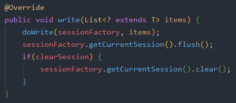

## ItemWriter

Writer는 Reader, Processor와 함께 ChunkOrientedTasklet을 구성하는 3요소이다. Processor는 Tasklet의 선택적 구성요소기 때문에 Writer를 먼저 다룬다.

### 8-1. ItemWriter 소개

- Spring Batch의 **출력 기능**

초기에 ItemWriter는 ItemReader와 마찬가지로 item을 하나씩 다루었다. 그러나 Spring Batch2와 청크 (Chunk) 기반 처리의 도입으로 인해 ItemWriter에도 큰 변화가 있었다. 청크기반 처리 도입 이후에 ItemWriter는 item하나를 작성하지 않고 Chunk단위로 묶인 item List를 다룬다.

다음은 ItemWriter 인터페이스이다.


Reader의 `read()`는 item하나를 반환하는 반면, Writer의 `write()`는 인자로 Item List를 받는다.

그림으로 표현하면 아래와 같다.


- ItemReader를 통해 각 항목을 개별적으로 읽고 이를 처리하기 위해 ItemProcessor에 전달한다.
- process()는 item 갯수가 처리될 때까지 계속된다.
- 청크 단위만큼 처리가 완료되면 Writer에 전달되어 Writer에 명시되어 있는대로 일괄 처리한다.

즉, Reader와 Processor를 거쳐 처리된 item을 Chunk 단위만큼 쌓은 뒤 이를 Writer에 전달하는 것이다.

Sprint Batch는 다양한 Output 타입을 처리할 수 있도록 많은 Writer를 제공한다. Reader와 마찬가지로 DB관련 내용만 다룬다.

### 8-2. Database Writer

Java에서는 JDBC 또는 ORM을 사용하여 RDBMS에 접근한다.

Spring Batch는 JDBC와 ORM 모두 Writer를 제공한다. Writer는 Chunk 단위의 마지막 단계이다. 그래서 DB의 영속성과 관련해서는 항상 **마지막에 flush를 해줘야 한다. (영속성 Context와 DB를 싱크한다.)**

예를 들어 아래와 같이 영속성을 사용하는 JPA, Hibernate의 경우 ItemWriter 구현체에서는 `flush()`와 `session.clear()`가 따라온다.


(JpaItemWriter)


(HibernateWriter)

Writer가 받은 모든 Item이 처리된 후, Spring Batch는 현재 트랜잭션을 커밋한다. DB와 관련된 Writer는 아래와 같이 3가지가 있다.

- JdbcBatchItemWriter
- HibernateItemWriter
- JpaItemWriter

### 8-3. JdbcBatchItemWriter

ORM을 사용하지 않는 경우 Writer는 대부분 JdbcBatchItemWriter를 사용한다. 이 JdbcBatchItemWriter는 아래 그림과 같이 JDBC의 Batch 기능을 사용하여 한번에 DB로 전달하여 DB 내부에서 쿼리들이 실행되도록 한다.


이는 어플리케이션과 DB 간 데이터를 주고받는 횟수를 최소화 하여 성능을 향상시키기 위함이다.

> 업데이트를 일괄 처리로 그룹화하면 DB와 어플리케이션간 왕복 횟수가 줄어들어 성능이 향상된다.

JdbcBatchItemWriter의 `write()`를 확인해보면 일괄처리하는 것을 확인할 수 있다.


다음에서 일괄처리를 확인할 수 있다.

1. `namedParameterJdbcTemplate.batchUpdate(...)`
2. `pa.addBatch()`

`JdbcBatchItemWriterJobConfiguration.class`

```java
@Slf4j
@RequiredArgsConstructor
@Configuration
public class JdbcBatchItemWriterJobConfiguration {
    private final JobBuilderFactory jobBuilderFactory;
    private final StepBuilderFactory stepBuilderFactory;
    private final DataSource dataSource;

    private static final int chunkSize = 10;

    @Bean
    public Job jdbcBatchItemWriterJob() {
        return jobBuilderFactory.get("jdbcBatchItemWriterJob")
                .start(jdbcBatchItemWriterStep())
                .build();
    }

    @Bean
    public Step jdbcBatchItemWriterStep() {
        return stepBuilderFactory.get("jdbcBatchItemWriterStep")
                .<Pay, Pay>chunk(chunkSize)
                .reader(jdbcBatchItemWriterReader())
                .writer(jdbcBatchItemWriter())
                .build();
    }

    @Bean
    public JdbcCursorItemReader<Pay> jdbcBatchItemWriterReader() {
        return new JdbcCursorItemReaderBuilder<Pay>()
                .fetchSize(chunkSize)
                .dataSource(dataSource)
                .rowMapper(new BeanPropertyRowMapper<>(Pay.class))
                .sql("SELECT id, amount, tx_name, tx_date_time FROM pay")
                .name("jdbcBatchItemWriter")
                .build();
    }

    /**
     * reader에서 넘어온 데이터를 하나씩 출력하는 writer
     */
    @Bean // beanMapped()을 사용할때는 필수
    public JdbcBatchItemWriter<Pay> jdbcBatchItemWriter() {
        return new JdbcBatchItemWriterBuilder<Pay>()
                .dataSource(dataSource)
                .sql("insert into pay2(amount, tx_name, tx_date_time) values (:amount, :txName, :txDateTime)")
                .beanMapped()
                .build();
    }
}
```

JdbcBatchItemWriterBuilder는 다음과 같은 설정값을 갖고 있다.

| Property | Parameter | 설명 |
| -------- | -------- | ---- |
| assertUpdates | boolean | 하나의 항목이 행을 업데이트하거나 삭제하지 않을 경우 예외 throw할지 설정한다. 기본값은 true이다. |
| columnMapped | 없음 | Key, Value 기반으로 Insert SQL의 Values를 매핑한다. (ex: MapString, Object) |
| beanMapped | 없음 | Pojo 기반 insert SQL 의 Value 매핑 |

위 예제는 `beanMapped`로 작성되었다. 위 예제를 `columnMapped`로 변경하면 다음과 같은 코드가 된다.

```java
new JdbcBatchItemWriterBuilder<Map<String, Object>>()
			.columnMapped()
			.dataSource(this.dataSource)
			.sql("insert into pay2(amount, tx_name, tx_date_time) values (:amount, :txName, :txDateTime)")
			.build();
```

차이는 Reader에서 Writer로 넘겨주는 타입이 `Map<String, Object>`냐, `Pay.class`와 같은 Pojo 타입이냐이다.

추가적으로 `values(:field)`의 경우는 Dto의 Getter 혹은 Map의 Key에 매핑되어 값이 할당된다.

JdbcBatchItemWriterBuilder가 아닌 `JdbcBatchItemWriter`의 설정에서 주의할게 하나 있다. 

- JdbcBatchItemWriter의 제네릭 타입은 **Reader에서 넘겨주는 값의 타입**이다.

코드에도 나와있지만, Pay2 테이블에 데이터를 넣은 Writer이지만 선언된 제네릭 타입은 Reader/Processor에서 넘겨준 Pay 클래스이다.

이외에도 추가적으로 알아야할 메소드는 `afterPropertiesSet`정도이다.

이 메소드는 `InitializingBean`인터페이스에서 갖고있는 메소드이다. JdbcBatchItemWriter, JpaItemWriter등 ItemWriter의 구현체들은 모두 `InitializingBean`인터페이스를 구현하고 있다. 여기서 `afterPropertiesSet`이 하는 일은 각각의 Writer들이 실행되기 위해 필요한 필수값들이 제대로 세팅되어있는지 체크하는 것이다.


Writer 생성 이후 위 메소드를 실행해보면 어느 값이 누락되었는지 명확히 인지할 수 있어서 많이 사용되는 옵션이다.

### 8-4. JpaItemWriter

다음은 ORM을 사용할 수 있는 `JpaItemWriter`이다. Writer에 전달하는 데이터가 Entity 클래스라면 JpaItemWriter를 사용하면 된다.

```java
@Slf4j
@RequiredArgsConstructor
@Configuration
public class JpaItemWriterJobConfiguration {
    private final JobBuilderFactory jobBuilderFactory;
    private final StepBuilderFactory stepBuilderFactory;
    private final EntityManagerFactory entityManagerFactory;

    private static final int chunkSize = 10;

    @Bean
    public Job jpaItemWriterJob() {
        return jobBuilderFactory.get("jpaItemWriterJob")
                .start(jpaItemWriterStep())
                .build();
    }

    @Bean
    public Step jpaItemWriterStep() {
        return stepBuilderFactory.get("jpaItemWriterStep")
                .<Pay, Pay2>chunk(chunkSize)
                .reader(jpaItemWriterReader())
                .processor(jpaItemProcessor())
                .writer(jpaItemWriter())
                .build();
    }

    @Bean
    public JpaPagingItemReader<Pay> jpaItemWriterReader() {
        return new JpaPagingItemReaderBuilder<Pay>()
                .name("jpaItemWriterReader")
                .entityManagerFactory(entityManagerFactory)
                .pageSize(chunkSize)
                .queryString("SELECT p FROM Pay p")
                .build();
    }

    @Bean
    public ItemProcessor<Pay, Pay2> jpaItemProcessor() {
        return pay -> new Pay2(pay.getAmount(), pay.getTxName(), pay.getTxDateTime());
    }

    @Bean
    public JpaItemWriter<Pay2> jpaItemWriter() {
        JpaItemWriter<Pay2> jpaItemWriter = new JpaItemWriter<>();
        jpaItemWriter.setEntityManagerFactory(entityManagerFactory);
        return jpaItemWriter;
    }
}
```

JpaItemWriter는 JPA를 사용하기 때문에 영속성 관리를 위해 EntityManager를 할당해줘야 한다. 이를 위해 의존성에 `spring-boot-starter-data-jpa`를 등록해줘야하지만 필수 설정값은 EntityManager뿐이다.

JdbcBatchItemWriter에 비해 필수값이 Entity Manager 뿐이라 체크할 요소가 적다.


EntityManager만 set하면 모든 설정은 끝난다.

여기서 JdbcBatchItemWriter와 다른것이 있다면 processor가 추가된 것이다.

JpaItemWriter는 JdbcBatchItemWriter와 달리 넘어온 Entity를 DB에 반영한다. 즉, JpaItemWriter는 Entity 클래스를 제네릭 타입으로 받아야한다.

jdbcBatchItemWriter의 경우 DTO클래스를 받더라도 sql로 지정된 쿼리가 실행되서 문제가 없지만, JpaItemWriter는 넘어온 item을 그대로 `entityManager.merge()`로 테이블에 반영하기 때문이다.


`entityManager.merge(item);` 을 확인 가능하다.

이렇게만 설정하면 JpaItemWriter 사용법은 끝이다. 실제로 실행시 정상적으로 결과가 나오는것을 확인할 수 있다.


### 8-5. Custom ItemWriter

Reader와 달리 Writer의 경우 Custom하게 구현해야할 일이 많다.

#### 예시

- Reader에서 읽어온 데이터를 RestTemplate로 외부 API로 전달해야할때
- 임시저장을 하고 비교하기 위해 싱글톤 객체에 값을 넣어야할때
- 여러 Entity를 동시에 save 해야할때

등등 여러 상황이 있다.

이렇게 Spring Batch에서 공식적으로 지원하지 않는 Writer를 사용하고 싶을때 ItemWriter 인터페이스를 구현하면 된다.

아래는 processor에서 넘어온 데이터를 `System.out.println`으로 출력하는 Writer를 만든 경우다.

```java
@Slf4j
@RequiredArgsConstructor
@Configuration
public class CustomItemWriterJobConfiguration {
    private final JobBuilderFactory jobBuilderFactory;
    private final StepBuilderFactory stepBuilderFactory;
    private final EntityManagerFactory entityManagerFactory;

    private static final int chunkSize = 10;

    @Bean
    public Job customItemWriterJob() {
        return jobBuilderFactory.get("customItemWriterJob")
                .start(customItemWriterStep())
                .build();
    }

    @Bean
    public Step customItemWriterStep() {
        return stepBuilderFactory.get("customItemWriterStep")
                .<Pay, Pay2>chunk(chunkSize)
                .reader(customItemWriterReader())
                .processor(customItemWriterProcessor())
                .writer(customItemWriter())
                .build();
    }

    @Bean
    public JpaPagingItemReader<Pay> customItemWriterReader() {
        return new JpaPagingItemReaderBuilder<Pay>()
                .name("customItemWriterReader")
                .entityManagerFactory(entityManagerFactory)
                .pageSize(chunkSize)
                .queryString("SELECT p FROM Pay p")
                .build();
    }

    @Bean
    public ItemProcessor<Pay, Pay2> customItemWriterProcessor() {
        return pay -> new Pay2(pay.getAmount(), pay.getTxName(), pay.getTxDateTime());
    }

    @Bean
    public ItemWriter<Pay2> customItemWriter() {
        return new ItemWriter<Pay2>() {
            @Override
            public void write(List<? extends Pay2> items) throws Exception {
                for (Pay2 item : items) {
                    System.out.println(item);
                }
            }
        };
    }
}
```

위와 같이 `write()` 만 `@Override`하면 구현체 생성은 끝난다.