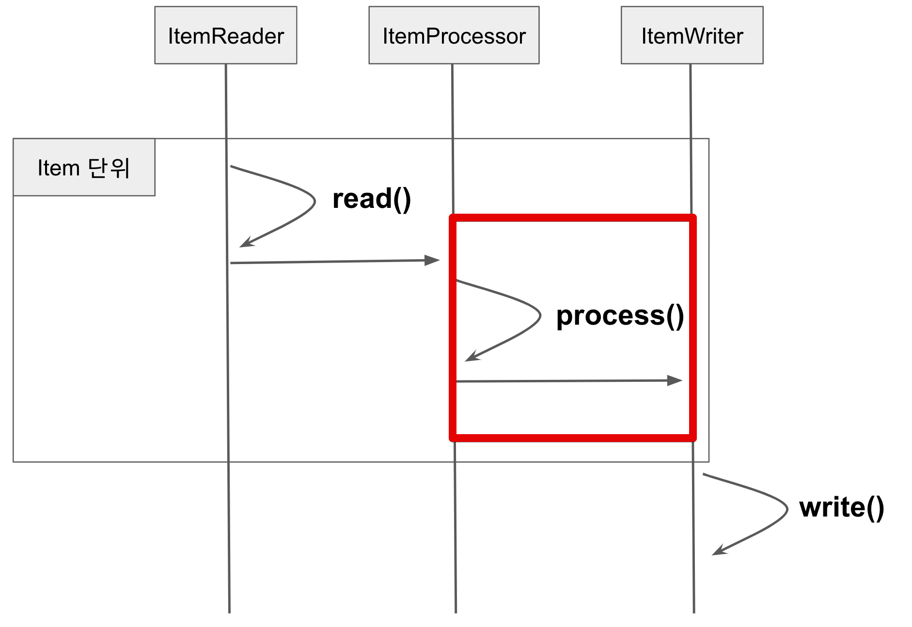
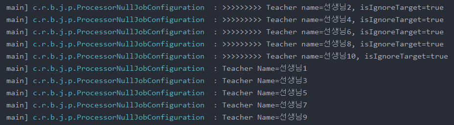
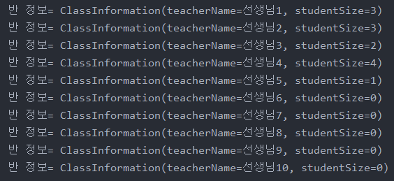
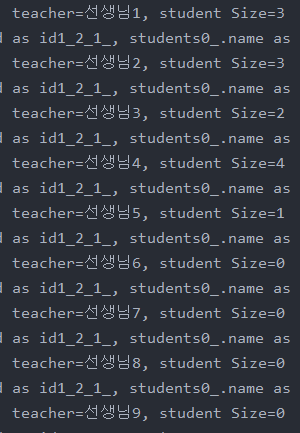
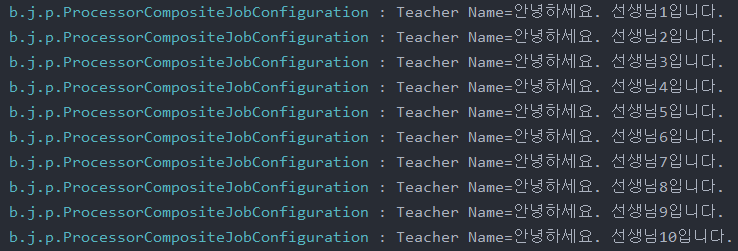

## ItemProcessor

ItemProcessor는 데이터의 가공과 필터링 역할을 한다. 이는 Writer 부분에서도 충분히 구현 가능하다. 그러나 이를 쓰는 이유는 Reader, Writer와 별도의 단계로 분리하여 비즈니스 코드가 섞이는 것을 방지하기 때문이다.

일반적으로 배치 어플리케이션에서 비즈니스 로직을 추가할때는 가장 먼저 Processor를 고려하는 것이 각 계층(읽기/처리/쓰기)을 분리할 수 있는 좋은 방법이다.

이번 챕터에서 배울 내용은 다음과 같다.

- process 단계에서 처리할 수 있는 비즈니스 로직의 종류
- 청크 지향 처리에서 ItemProcessor를 구성하는 방법
- Spring Batch와 함께 제공되는 ItemProcessor 구현

### 9-1. ItemProcessor?

Reader에서 넘겨준 데이터 개별건을 **가공/처리**한다. ChunkSize 단위로 묶은 데이터를 한번에 처리하는 ItemWriter와는 대조된다.



일반적인 사용 방법은 2가지이다.

- 변환
    - Reader에서 읽은 데이터를 원하는 타입으로 변환해서 Writer에 넘긴다.
- 필터
    - Reader에서 넘겨준 데이터를 Writer로 넘겨줄 것인지 결정할 수 있다.
    - `null`을 반환하면 Writer에 전달되지 않는다.

### 9-2. 기본 사용법

ItemProcessor 인터페이스는 두 개의 제네릭 타입이 필요하다.

```java
public interface ItemProcessor<I, O> {
	O process(I item) throws Exception;
}
```

- I
    - ItemReader에서 받을 데이터 타입
- O
    - ItemWriter에 보낼 데이터 타입

Reader에서 읽은 데이터가 ItemProcessor의 `process`를 통과해서 Writer에 전달된다. 구현해야할 메소드는 `process`하나이다. 따라서 이는 람다식을 사용할 수 있다.

람다식 예시

```java
@Bean(BEAN_PREFIX + "processor")
@StepScope
public ItemProcessor<ReadType, WriteType> processor() {
    return item -> {
        item.convert();
        return item;
    };
}
```

람다식 사용 이유는 다음과 같다.

- 행사코드가 없어 구현 코드가 적음
- 고정된 형태가 없어 어떤 처리도 가능

다만 단점도 있다.

- Batch Config 클래스 안에 포함되어 있어야만해서 Batch Config 코드 양이 많아질 수 있다.
- 이 단점으로 인해 보통 코드 양이 많아지면 별도 클래스로 Processor를 분리해서 쓰기도 한다.

### 9-3. 변환

첫번째로 알아볼 예제는 변환이다.

즉, Reader에서 읽은 타입을 Writer에 전달해주는 것을 얘기한다.

다음 코드는 Teacher라는 도메인 클래스를 읽어 Name 필드 (String 타입)을 Writer에 넘겨주도록 구성한 코드이다.

```java
@Slf4j
@RequiredArgsConstructor
@Configuration
public class ProcessorConvertJobConfiguration {

    public static final String JOB_NAME = "ProcessorConvertBatch";
    public static final String BEAN_PREFIX = JOB_NAME + "_";

    private final JobBuilderFactory jobBuilderFactory;
    private final StepBuilderFactory stepBuilderFactory;
    private final EntityManagerFactory emf;

    @Value("${chunkSize:1000}")
    private int chunkSize;

    @Bean(JOB_NAME)
    public Job job() {
        return jobBuilderFactory.get(JOB_NAME)
                .preventRestart()
                .start(step())
                .build();
    }

    @Bean(BEAN_PREFIX + "step")
    @JobScope
    public Step step() {
        return stepBuilderFactory.get(BEAN_PREFIX + "step")
                .<Teacher, String>chunk(chunkSize)
                .reader(reader())
                .processor(processor())
                .writer(writer())
                .build();
    }

    @Bean(BEAN_PREFIX + "reader")
    public JpaPagingItemReader<Teacher> reader() {
        return new JpaPagingItemReaderBuilder<Teacher>()
                .name(BEAN_PREFIX+"reader")
                .entityManagerFactory(emf)
                .pageSize(chunkSize)
                .queryString("SELECT t FROM Teacher t")
                .build();
    }

    @Bean(BEAN_PREFIX + "processor")
    public ItemProcessor<Teacher, String> processor() {
        return teacher -> {
            return teacher.getName();
        };
    }

    private ItemWriter<String> writer() {
        return items -> {
            for (String item : items) {
                log.info("Teacher Name={}", item);
            }
        };
    }
}
```

ItemProcessor에서는 Reader에서 읽어올 타입이 `Teacher`이며, Writer에서 넘겨줄 타입이 `String`이기 때문에 제네릭 타입은 `<Teacher, String>`이 된다.

```java
@Bean
public ItemProcessor<Teacher, String> processor() {
		return teacher -> {
				return teacher.getName();
		}
}
```

여기서 ChunkSize 앞에 선언될 타입 역시 Reader와 Writer 타입을 따라가야하기 때문에 다음과 같이 선언된다.

```java
.<Teacher, String>chunk(chunkSize)
```

### 9-4. 필터

다음으로 알아볼 예제는 필터이다.

즉, Writer에 값을 넘길지를 Processor에서 판단한다.

```java
@Slf4j
@RequiredArgsConstructor
@Configuration
public class ProcessorNullJobConfiguration {

    public static final String JOB_NAME = "processorNullBatch";
    public static final String BEAN_PREFIX = JOB_NAME + "_";

    private final JobBuilderFactory jobBuilderFactory;
    private final StepBuilderFactory stepBuilderFactory;
    private final EntityManagerFactory emf;

    @Value("${chunkSize:1000}")
    private int chunkSize;

    @Bean(JOB_NAME)
    public Job job() {
        return jobBuilderFactory.get(JOB_NAME)
                .preventRestart()
                .start(step())
                .build();
    }

    @Bean(BEAN_PREFIX + "step")
    @JobScope
    public Step step() {
        return stepBuilderFactory.get(BEAN_PREFIX + "step")
                .<Teacher, Teacher>chunk(chunkSize)
                .reader(reader())
                .processor(processor())
                .writer(writer())
                .build();
    }

    @Bean(BEAN_PREFIX + "reader")
    public JpaPagingItemReader<Teacher> reader() {
        return new JpaPagingItemReaderBuilder<Teacher>()
                .name(BEAN_PREFIX+"reader")
                .entityManagerFactory(emf)
                .pageSize(chunkSize)
                .queryString("SELECT t FROM Teacher t")
                .build();
    }

    @Bean(BEAN_PREFIX + "processor")
    public ItemProcessor<Teacher, Teacher> processor() {
        return teacher -> {

            boolean isIgnoreTarget = teacher.getId() % 2 == 0L;
            if(isIgnoreTarget){
                log.info(">>>>>>>>> Teacher name={}, isIgnoreTarget={}", teacher.getName(), isIgnoreTarget);
                return null;
            }

            return teacher;
        };
    }

    private ItemWriter<Teacher> writer() {
        return items -> {
            for (Teacher item : items) {
                log.info("Teacher Name={}", item.getName());
            }
        };
    }
}
```

ItemProcessor에서는 id가 짝수일 경우 return null;을 함으로써 Writer에 넘기지 않도록 한다.



### 9-5. 트랜잭션 범위

Spring Batch에서 트랜잭션 범위는 Chunk 단위이다.

그래서 Reader에서 Entity를 반환해주었다면 Entity간의 Lazy Loading이 가능하다. 이건 Processor뿐 아니라 Writer 까지도 가능하다.

### 9-5-1. Processor

첫번째 예제는 **Processor에서의 Lazy Loading**이다.

아래 코드는 Reader에서 `Teacher` Entity를 반환하여 Processor에서 Entity 하위 자식들인 `Student`를 Lazy Loading 한다.

```java
@Slf4j
@RequiredArgsConstructor
@Configuration
public class TransactionProcessorJobConfiguration {

    public static final String JOB_NAME = "transactionProcessorBatch";
    public static final String BEAN_PREFIX = JOB_NAME + "_";

    private final JobBuilderFactory jobBuilderFactory;
    private final StepBuilderFactory stepBuilderFactory;
    private final EntityManagerFactory emf;

    @Value("${chunkSize:1000}")
    private int chunkSize;

    @Bean(JOB_NAME)
    public Job job() {
        return jobBuilderFactory.get(JOB_NAME)
                .preventRestart()
                .start(step())
                .build();
    }

    @Bean(BEAN_PREFIX + "step")
    @JobScope
    public Step step() {
        return stepBuilderFactory.get(BEAN_PREFIX + "step")
                .<Teacher, ClassInformation>chunk(chunkSize)
                .reader(reader())
                .processor(processor())
                .writer(writer())
                .build();
    }

    @Bean(BEAN_PREFIX + "reader")
    public JpaPagingItemReader<Teacher> reader() {
        return new JpaPagingItemReaderBuilder<Teacher>()
                .name(BEAN_PREFIX+"reader")
                .entityManagerFactory(emf)
                .pageSize(chunkSize)
                .queryString("SELECT t FROM Teacher t")
                .build();
    }

    public ItemProcessor<Teacher, ClassInformation> processor() {
        return teacher -> new ClassInformation(teacher.getName(), teacher.getStudents().size());
    }

    private ItemWriter<ClassInformation> writer() {
        return items -> {
            log.info(">>>>>>>>>>> Item Write");
            for (ClassInformation item : items) {
                log.info("반 정보= {}", item);
            }    
        };
    }
}
```

Processor 부분에서 `teacher.getStudents()`로 가져오고 있다.

```java
public ItemProcessor<Teacher, ClassInformation> processor() {
        return teacher -> new ClassInformation(teacher.getName(), teacher.getStudents().size());
    }
```

Processor가 트랜잭션 범위 밖이라면 (Lazy Loading 실패로) 오류가 나야 정상이지만 실제 실행시



배치가 실행된다는 것을 확인할 수 있다. **즉, Processor는 트랜잭션 범위 안이며, Entity Lazy Loading이 가능하다는 것을 확인했다.**

### 9-5-2. Writer

이번에는 Writer에서의 Lazy Loading을 알아본다.

다음은 Reader에서 `Teacher` Entity를 반환해, Processor를 거치지 않고 Writer로 바로 넘겨 Writer에서 Entity의 하위 자식들만 `Student`를 Lazy Loading 한다.

```java
@Slf4j
@RequiredArgsConstructor
@Configuration
public class TransactionWriterJobConfiguration {

    public static final String JOB_NAME = "transactionWriterBatch";
    public static final String BEAN_PREFIX = JOB_NAME + "_";

    private final JobBuilderFactory jobBuilderFactory;
    private final StepBuilderFactory stepBuilderFactory;
    private final EntityManagerFactory emf;

    @Value("${chunkSize:1000}")
    private int chunkSize;

    @Bean(JOB_NAME)
    public Job job() {
        return jobBuilderFactory.get(JOB_NAME)
                .preventRestart()
                .start(step())
                .build();
    }

    @Bean(BEAN_PREFIX + "step")
    @JobScope
    public Step step() {
        return stepBuilderFactory.get(BEAN_PREFIX + "step")
                .<Teacher, Teacher>chunk(chunkSize)
                .reader(reader())
                .writer(writer())
                .build();
    }

    @Bean
    public JpaPagingItemReader<Teacher> reader() {
        return new JpaPagingItemReaderBuilder<Teacher>()
                .name(BEAN_PREFIX+"reader")
                .entityManagerFactory(emf)
                .pageSize(chunkSize)
                .queryString("SELECT t FROM Teacher t")
                .build();
    }

    private ItemWriter<Teacher> writer() {
        return items -> {
            log.info(">>>>>>>>>>> Item Write");
            for (Teacher item : items) {
                log.info("teacher={}, student Size={}", item.getName(), item.getStudents().size());
            }    
        };
    }
}
```

이 또한 실행시



트랜잭션 범위 내라는 것을 확인할 수 있다. 

### 9-6. ItemProcessor 구현체

Spring Batch에서는 자주 사용하는 용도의 Processor를 미리 클래스로 만들어 제공하고 있다. 이는 3 종류가 존재한다.

- ItemProcessorAdapter
- ValidatingItemProcessor
- CompositeItemProcessor

하지만 최근에는 대부분 Processor 구현을 람다식등으로 빠르게 구현하는 경우가 많다. 따라서 커스텀하게 직접 구현해도 되는 역할을 수행하는 위 두가지는 거의 사용하지 않는다.

그러나 CompositeItemProcessor는 간혹 필요한 경우가 있다.

이는 ItemProcessor간 체이닝을 지원하는 Processor라 할 수 있다.

Processor의 역할은 변환 혹은 필터이다. 하지만 이 변환이 2번 필요하다면 어떨까? 하나의 Processor에서 모두 변환하기에는 역할이 너무 커질 것이다. CompositeItemProcessor는 이런 의문에서 시작되었다.

아래의 예제는 `Teacher`의 이름을 가져와 문장을 생성해 Writer에 전달하는 예제이다.

```java
@Slf4j
@RequiredArgsConstructor
@Configuration
public class ProcessorCompositeJobConfiguration {

    public static final String JOB_NAME = "processorCompositeBatch";
    public static final String BEAN_PREFIX = JOB_NAME + "_";

    private final JobBuilderFactory jobBuilderFactory;
    private final StepBuilderFactory stepBuilderFactory;
    private final EntityManagerFactory emf;

    @Value("${chunkSize:1000}")
    private int chunkSize;

    @Bean(JOB_NAME)
    public Job job() {
        return jobBuilderFactory.get(JOB_NAME)
                .preventRestart()
                .start(step())
                .build();
    }

    @Bean(BEAN_PREFIX + "step")
    @JobScope
    public Step step() {
        return stepBuilderFactory.get(BEAN_PREFIX + "step")
                .<Teacher, String>chunk(chunkSize)
                .reader(reader())
                .processor(compositeProcessor())
                .writer(writer())
                .build();
    }

    @Bean
    public JpaPagingItemReader<Teacher> reader() {
        return new JpaPagingItemReaderBuilder<Teacher>()
                .name(BEAN_PREFIX+"reader")
                .entityManagerFactory(emf)
                .pageSize(chunkSize)
                .queryString("SELECT t FROM Teacher t")
                .build();
    }

    @Bean
    public CompositeItemProcessor<Teacher, String> compositeProcessor() {
        List<ItemProcessor> delegates = new ArrayList<>(2);
        delegates.add(processor1());
        delegates.add(processor2());

        CompositeItemProcessor processor = new CompositeItemProcessor<>();

        processor.setDelegates(delegates);

        return processor;
    }

    public ItemProcessor<Teacher, String> processor1() {
        return Teacher::getName;
    }

    public ItemProcessor<String, String> processor2() {
        return name -> "안녕하세요. "+ name + "입니다.";
    }

    private ItemWriter<String> writer() {
        return items -> {
            for (String item : items) {
                log.info("Teacher Name={}", item);
            }
        };
    }
}
```

- 이와 유사하게 다른 클래스 타입으로의 변환도 가능하다.

```java
@Bean
public CompositeItemProcessor compositeProcessor() {
    List<ItemProcessor> delegates = new ArrayList<>(2);
    delegates.add(processor1());
    delegates.add(processor2());

    CompositeItemProcessor processor = new CompositeItemProcessor<>();

    processor.setDelegates(delegates);

    return processor;
}
```

CompositeItemProcessor에 ItemProcessor List인 `delegates`를 할당만 하면 모든 구현이 끝난다. 그러나 여기서는 제네릭 타입을 쓰지 못하는데, 그 이유는 제네릭 타입을 쓰게되면 `delegates`에 포함된 모든 ItemProcessor가 같은 제네릭 타입을 가져야하기 때문이다.

지금의 경우 processor1은 `<Teacher, String>`을 processor2는 `<String, String>`이다. 이는 같은 제네릭 타입을 사용하지 않기 때문에 예제에 제네릭이 사용되지 않고 있다. 만약 같은 제네릭 타입을 쓰는 ItemProcessor간 체이닝이라면 제네릭을 선언할 수 있다.

