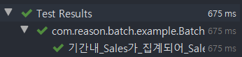
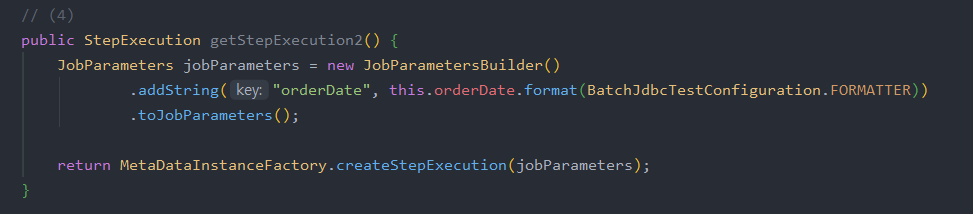
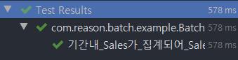

## 단위 테스트

웹 애플리케이션을 개발하다보면 통합 테스트보다 단위 테스트가 훨씬 더 많이 작성된다. 단위 테스트로 많은 코드를 검증한 후, 통합 테스트 코드를 통해 각 단위가 합쳐졌을때 잘 작동 되는지 검증하곤 한다. 

그러나, 스프링 배치를 이용한 배치 어플리케이션에서는 많은 사람들이 통합 테스트만 작성할때가 많다. 이전에 언급했듯 스프링 배치의 단위 테스트 작성이 통합 테스트보다 복잡하기 때문이다.

이번 챕터에서는 다음 질문들에 대해 이야기한다.

- Reader의 쿼리가 잘 작동되었는지 어떻게 확인하는가
- StepScope를 통한 JobParameter가 잘 할당 된다는 것은 어떻게 확인하는가

Reader의 단위 테스트는 Query의 동작에 초점을 맞춰서 진행한다.

1. StepScope & JobScope가 없는 테스트
2. StepScope & JobScope가 필요한 테스트

### 10.1.1 StepScope 가 필요 없는 단위 테스트

Jdbc를 사용하는 배치를 만든다고 가정한다.

전체 스프링 배치 코드를 작성하기까지 시간이 필요해 그전에 빠르게 JdbcItemReader의 쿼리만 검증하는 테스트 코드를 작성하고 싶을때가 많다.

전체 코드를 모두 작성하고 테스트를 시작하기에는 부담이 많이 되기 때문이다. 그래서 **최소한의 내용만 구현된** Reader 테스트 코드를 만들어본다.

> 참고로 이 방식은 JPA에서는 사용하기 어렵다.
Spring Data Jpa를 통해 생성되는 여러 환경들을 본인이 직접 구성해야하기 때문이다.

다음은 테스트 대상인 배치 코드이다.

```java
@Slf4j // log 사용을 위한 lombok 어노테이션
@RequiredArgsConstructor // 생성자 DI를 위한 lombok 어노테이션
@Configuration
public class BatchOnlyJdbcReaderTestConfiguration {
    public static final DateTimeFormatter FORMATTER = ofPattern("yyyy-MM-dd");
    public static final String JOB_NAME = "batchOnlyJdbcReaderTestJob";

    private final DataSource dataSource;

    private int chunkSize;

    @Value("${chunkSize:1000}")
    public void setChunkSize(int chunkSize) {
        this.chunkSize = chunkSize;
    }

    @Bean
    @StepScope
    public JdbcPagingItemReader<SalesSum> batchOnlyJdbcReaderTestJobReader(
            @Value("#{jobParameters[orderDate]}") String orderDate) throws Exception {

        Map<String, Object> params = new HashMap<>();

        params.put("orderDate", LocalDate.parse(orderDate, FORMATTER));

        SqlPagingQueryProviderFactoryBean queryProvider = new SqlPagingQueryProviderFactoryBean();
        queryProvider.setDataSource(dataSource);
        queryProvider.setSelectClause("order_date, sum(amount) as amount_sum");
        queryProvider.setFromClause("from sales");
        queryProvider.setWhereClause("where order_date =:orderDate");
        queryProvider.setGroupClause("group by order_date");
        queryProvider.setSortKey("order_date");

        return new JdbcPagingItemReaderBuilder<SalesSum>()
                .name("batchOnlyJdbcReaderTestJobReader")
                .pageSize(chunkSize)
                .fetchSize(chunkSize)
                .dataSource(dataSource)
                .rowMapper(new BeanPropertyRowMapper<>(SalesSum.class))
                .queryProvider(queryProvider.getObject())
                .parameterValues(params)
                .build();
    }
}
```

코드를 확인해보면 딱 Reader 부분만 있는 상태이다.

즉, Job / Step / Processor / Writer를 모두 구현하지 않은 상태이며 Reader쿼리가 정상이면 언제든 나머지 부분을 구현하면 되는 상태이다.

이 배치 코드를 테스트 한다면 다음과 같이 작성할 수 있다.

```java
public class BatchNoSpringContextUnitTest2 {

    private DataSource dataSource;
    private JdbcTemplate jdbcTemplate;
    private ConfigurableApplicationContext context;
    private LocalDate orderDate;
    private BatchOnlyJdbcReaderTestConfiguration job;

    @Before
    public void setUp() {
        this.context = new AnnotationConfigApplicationContext(TestDataSourceConfiguration.class); // (1)
        this.dataSource = (DataSource) context.getBean("dataSource"); // (2)
        this.jdbcTemplate = new JdbcTemplate(this.dataSource); // (3)
        this.orderDate = LocalDate.of(2019, 10, 6);
        this.job = new BatchOnlyJdbcReaderTestConfiguration(dataSource); // (4)
        this.job.setChunkSize(10); // (5)
    }

    @After
    public void tearDown() {
        if (this.context != null) {
            this.context.close();
        }
    }

    @Test
    public void 기간내_Sales가_집계되어_SalesSum이된다() throws Exception {
        // given
        long amount1 = 1000;
        long amount2 = 100;
        long amount3 = 10;
        jdbcTemplate.update("insert into sales (order_date, amount, order_no) values (?, ?, ?)", orderDate, amount1, "1"); // (1)
        jdbcTemplate.update("insert into sales (order_date, amount, order_no) values (?, ?, ?)", orderDate, amount2, "2");
        jdbcTemplate.update("insert into sales (order_date, amount, order_no) values (?, ?, ?)", orderDate, amount3, "3");

        JdbcPagingItemReader<SalesSum> reader = job.batchOnlyJdbcReaderTestJobReader(orderDate.format(FORMATTER)); // (2)
        reader.afterPropertiesSet(); // (3)

        // when & then
        assertThat(reader.read().getAmountSum()).isEqualTo(amount1 + amount2 + amount3); // (4)
        assertThat(reader.read()).isNull(); //(5)
    }

    @Configuration
    public static class TestDataSourceConfiguration {

        // (1)
        private static final String CREATE_SQL =
                        "create table IF NOT EXISTS `sales` (id bigint not null auto_increment, amount bigint not null, order_date date, order_no varchar(255), primary key (id));";

        // (2)
        @Bean
        public DataSource dataSource() {
            EmbeddedDatabaseFactory databaseFactory = new EmbeddedDatabaseFactory();
            databaseFactory.setDatabaseType(H2);
            return databaseFactory.getDatabase();
        }

        // (3)
        @Bean
        public DataSourceInitializer initializer(DataSource dataSource) {
            DataSourceInitializer dataSourceInitializer = new DataSourceInitializer();
            dataSourceInitializer.setDataSource(dataSource);

            Resource create = new ByteArrayResource(CREATE_SQL.getBytes());
            dataSourceInitializer.setDatabasePopulator(new ResourceDatabasePopulator(create));

            return dataSourceInitializer;
        }
    }
}
```

코드가 길기 때문에 나눠서 설명하도록 한다.

### setUp

```java
private DataSource dataSource;
private JdbcTemplate jdbcTemplate;
private ConfigurableApplicationContext context;
private LocalDate orderDate;
private BatchOnlyJdbcReaderTestConfiguration job;

@Before
public void setUp() {
    this.context = new AnnotationConfigApplicationContext(TestDataSourceConfiguration.class); // (1)
    this.dataSource = (DataSource) context.getBean("dataSource"); // (2)
    this.jdbcTemplate = new JdbcTemplate(this.dataSource); // (3)
    this.orderDate = LocalDate.of(2019, 10, 6);
    this.job = new BatchOnlyJdbcReaderTestConfiguration(dataSource); // (4)
    this.job.setChunkSize(10); // (5)
}
```

1. `AnnotationConfigApplicationContext(TestDataSourceConfiguration.class)`
    - `DataSource`, `JdbcTemplate`, `Reader` 등이 실행될 수 있는 Context를 생성한다.
        - 해당 Context는 하단에서 별도로 구성한 `TestDataSourceConfiguration`의 Bean과 Configuration을 받아서 생성한다.
        - `TestDataSourceConfiguration`에 대한 설명은 하단에서 진행한다.
2. `(DataSource) context.getBean("dataSource")`
    - `TestDataSourceConfiguration`을 통해 생성된 DataSource Bean을 가져온다.
3. `new JdbcTemplate(this.dataSource)`
    - JdbcTemplate의 경우 지정된 DataSource가 있어야 하며, 해당 DB에 쿼리를 실행한다.
    - 지금 생성된 JdbcTemplate을 통해 `create table`, `insert` 등의 테스트 환경을 구축한다.
4. `new BatchOnlyJdbcReaderTestCongiruation(dataSource)`
    - 테스트할 대상인 Config에 2에서 생성한 DataSource를 생성자 주입한다.
        - 해당 Job Config에서 Reader인스턴스를 생성한다.
5. `this.job.setChunkSize(10)`
    - Reader의 PageSize / FetchSize를 결정하는 ChunkSize를 결정한다.
        - 원래 ChunkSize와 Reader의 PageSize / FetchSize는 목적이 다르다.
        - 다만 여러 이슈들에 대한 영향도를 줄이기 위해 보통 이 3가지 값들을 다 일치해서 사용한다.

Reader를 생성하는 `JdbcPagingItemReaderBuilder`에서는 pageSize가 지정되어 있지 않으면 에러를 발생시킨다. 따라서 **5의 설정은 필수적이다.**

테스트 대상인 `BatchOnlyJdbcReaderTestConfiguration`에서는 pageSize 값에 사용되는 chunkSize를 setter 인젝션하여 사용했다. setter 대신 생성자 인젝션을 사용해도 되지만 이 경우 chunkSize를 가진 Spring Bean을 별도로 생성해야 한다.

### Test Method

다음은 테스트가 수행될 메소드이다.

```java
@Test
public void 기간내_Sales가_집계되어_SalesSum이된다() throws Exception {
    // given
    long amount1 = 1000;
    long amount2 = 100;
    long amount3 = 10;
    jdbcTemplate.update("insert into sales (order_date, amount, order_no) values (?, ?, ?)", orderDate, amount1, "1"); // (1)
    jdbcTemplate.update("insert into sales (order_date, amount, order_no) values (?, ?, ?)", orderDate, amount2, "2");
    jdbcTemplate.update("insert into sales (order_date, amount, order_no) values (?, ?, ?)", orderDate, amount3, "3");

    JdbcPagingItemReader<SalesSum> reader = job.batchOnlyJdbcReaderTestJobReader(orderDate.format(FORMATTER)); // (2)
    reader.afterPropertiesSet(); // (3)

    // when & then
    assertThat(reader.read().getAmountSum()).isEqualTo(amount1 + amount2 + amount3); // (4)
    assertThat(reader.read()).isNull(); //(5)
}
```

1. `jdbcTemplate.update`
    - `insert`쿼리를 통해 테스트할 환경 구축한다.
    - 총 3개의 데이터를 등록한다.
2. `job.batchOnlyJdbcReaderTestJobReader`
    - `setUp`메소드에서 만든 Job에서 Reader를 가져온다.
3. `reader.afterPropertiesSet()`
    - Reader의 쿼리를 생성한다.
    - 이 메소드가 실행되지 않으면 **Reader의 쿼리가 null**이다.
4. `assertThat(reader.read())`
    - `group by` 결과로 원하는 값의 1개 row가 반환되는지 검증한다.
5. `assertThat(reader.read()).isNull()`
    - 조회 결과가 1개의 row라서 다음으로 읽을 row는 없으니 `null`임을 검증한다.

### Test Config

마지막으로 **테스트 코드가 수행되는 환경**을 만들어주는 `TestDataSourceConfiguration`을 확인한다.

```java
@Configuration
public static class TestDataSourceConfiguration {

    // (1)
    private static final String CREATE_SQL =
                    "create table IF NOT EXISTS `sales` (id bigint not null auto_increment, amount bigint not null, order_date date, order_no varchar(255), primary key (id));";

    // (2)
    @Bean
    public DataSource dataSource() {
        EmbeddedDatabaseFactory databaseFactory = new EmbeddedDatabaseFactory();
        databaseFactory.setDatabaseType(H2);
        return databaseFactory.getDatabase();
    }

    // (3)
    @Bean
    public DataSourceInitializer initializer(DataSource dataSource) {
        DataSourceInitializer dataSourceInitializer = new DataSourceInitializer();
        dataSourceInitializer.setDataSource(dataSource);

        Resource create = new ByteArrayResource(CREATE_SQL.getBytes());
        dataSourceInitializer.setDatabasePopulator(new ResourceDatabasePopulator(create));

        return dataSourceInitializer;
    }
}
```

1. `create table`
    - Reader의 쿼리가 수행될 테이블 (`sales`)를 생성하는 쿼리이다.
    - 제일 하단의 `DataSourceInitializer`에서 DB초기화 시점에 실행될 예정이다.
2. `@Bean dataSource`
    - 테스트용 DB를 실행한다.
        - `@SpringBootTest`, `@DataJpaTest` 등을 써본사람들은 H2를 이용한 테스트 환경과 동일하다고 생각하면 된다.
        - 인메모리 DB인 H2를 사용했기 때문에 편하게 실행/종료가 가능하다.
            - Gradle / Maven에 H2의존성이 꼭 있어야만 작동한다.
3. `@Bean initializer`
    - 2에서 생성된 DB에 어떤 초기작업을 수행할지 결정한다.
    - 여기서는 1의 `create table`쿼리를 2의 Database에 실행하는 작업을 설정한다.

이 모든 과정은 `@SpringBootTest`가 자동으로 해준다.
다만 이는 Spring에 관련된 모든 설정이 실행되다보니 한번 수행될때마다 오래걸린다. 지금의테스트는 순식간에 수행되기 때문에 속도면에서 충분한 장점이 있다.

### 10.1.2 StepScope가 필요한 단위 테스트

StepScope와 같이 스프링 배치만의 Scope가 있어야만 작동하는 스프링 배치 기능은 대표적으로 **JobParameter**가 있다.

JobParameter는 JobScope 혹은 StepScope가 있는 환경에서만 사용할 수 있다보니 앞에서와 같이 단순한 방식으로는 테스트할 수 없다.

StepScope 환경에서의 단위 테스트를 알아본다.
(JobScope환경의 경우 통합 테스트를 사용하면 된다)

`BatchJdbcTestConfiguration.class`

```java
@Slf4j
@RequiredArgsConstructor
@Configuration
public class BatchJdbcTestConfiguration {
    public static final DateTimeFormatter FORMATTER = ofPattern("yyyy-MM-dd");
    public static final String JOB_NAME = "batchJdbcUnitTestJob";

    private final JobBuilderFactory jobBuilderFactory;
    private final StepBuilderFactory stepBuilderFactory;
    private final DataSource dataSource;

    private int chunkSize;

    @Value("${chunkSize:1000}")
    public void setChunkSize(int chunkSize) {
        this.chunkSize = chunkSize;
    }

    @Bean
    public Job batchJdbcUnitTestJob() throws Exception {
        return jobBuilderFactory.get(JOB_NAME)
                .start(batchJdbcUnitTestJobStep())
                .build();
    }

    @Bean
    public Step batchJdbcUnitTestJobStep() throws Exception {
        return stepBuilderFactory.get("batchJdbcUnitTestJobStep")
                .<SalesSum, SalesSum>chunk(chunkSize)
                .reader(batchJdbcUnitTestJobReader(null))
                .writer(batchJdbcUnitTestJobWriter())
                .build();
    }

    @Bean
    @StepScope
    public JdbcPagingItemReader<SalesSum> batchJdbcUnitTestJobReader(
            @Value("#{jobParameters[orderDate]}") String orderDate) throws Exception {

        Map<String, Object> params = new HashMap<>();
        params.put("orderDate", LocalDate.parse(orderDate, FORMATTER));

        SqlPagingQueryProviderFactoryBean queryProvider = new SqlPagingQueryProviderFactoryBean();
        queryProvider.setDataSource(dataSource);
        queryProvider.setSelectClause("order_date, sum(amount) as amount_sum");
        queryProvider.setFromClause("from sales");
        queryProvider.setWhereClause("where order_date =:orderDate");
        queryProvider.setGroupClause("group by order_date");
        queryProvider.setSortKey("order_date");

        return new JdbcPagingItemReaderBuilder<SalesSum>()
                .name("batchJdbcUnitTestJobReader")
                .pageSize(chunkSize)
                .fetchSize(chunkSize)
                .dataSource(dataSource)
                .rowMapper(new BeanPropertyRowMapper<>(SalesSum.class))
                .queryProvider(queryProvider.getObject())
                .parameterValues(params)
                .build();
    }

    @Bean
    public JdbcBatchItemWriter<SalesSum> batchJdbcUnitTestJobWriter() {
        return new JdbcBatchItemWriterBuilder<SalesSum>()
                .dataSource(dataSource)
                .sql("insert into sales_sum(order_date, amount_sum) values (:order_date, :amount_sum)")
                .beanMapped()
                .build();
    }
}
```

- 테스트 코드는 10.1.1에서 변경이 있었다.
    - Job Bean이 없으면 테스트가 불가능하기 때문
- 10.1.1 코드에서 Job / Step / Writer가 추가된 코드이다.
- 실제 수행될 코드는 Reader 뿐이다.

### 4.0.x 이하 버전

```java
@RunWith(SpringRunner.class)
@EnableBatchProcessing // (1)
@TestExecutionListeners( { // (2)
        DependencyInjectionTestExecutionListener.class,
        StepScopeTestExecutionListener.class })
@ContextConfiguration(classes={ // (3)
        BatchJdbcTestConfiguration.class,
        BatchJdbcUnitTestJobConfigurationLegacyTest.TestDataSourceConfiguration.class})
public class BatchJdbcUnitTestJobConfigurationLegacyTest {

    @Autowired private JdbcPagingItemReader<SalesSum> reader;
    @Autowired private DataSource dataSource;

    private JdbcOperations jdbcTemplate;
    private LocalDate orderDate = LocalDate.of(2019, 10, 6);

    // (4)
    public StepExecution getStepExecution() {
        JobParameters jobParameters = new JobParametersBuilder()
                .addString("orderDate", this.orderDate.format(FORMATTER))
                .toJobParameters();

        return MetaDataInstanceFactory.createStepExecution(jobParameters);
    }

    @Before // (5)
    public void setUp() throws Exception {
        this.reader.setDataSource(this.dataSource);
        this.jdbcTemplate = new JdbcTemplate(this.dataSource);
    }

    @After // (6)
    public void tearDown() throws Exception {
        this.jdbcTemplate.update("delete from sales");
    }

    @Test
    public void 기간내_Sales가_집계되어_SalesSum이된다() throws Exception {
        //given
        long amount1 = 1000;
        long amount2 = 500;
        long amount3 = 100;

        saveSales(amount1, "1");
        saveSales(amount2, "2");
        saveSales(amount3, "3");

        // when && then
        assertThat(reader.read().getAmountSum()).isEqualTo(amount1+amount2+amount3);
        assertThat(reader.read()).isNull();
    }

    private void saveSales(long amount, String orderNo) {
        jdbcTemplate.update("insert into sales (order_date, amount, order_no) values (?, ?, ?)", this.orderDate, amount, orderNo);
    }

    // (7)
    @Configuration
    public static class TestDataSourceConfiguration {

        private static final String CREATE_SQL =
                "create table IF NOT EXISTS `sales` (id bigint not null auto_increment, amount bigint not null, order_date date, order_no varchar(255), primary key (id));";

        @Bean
        public DataSource dataSource() {
            EmbeddedDatabaseFactory databaseFactory = new EmbeddedDatabaseFactory();
            databaseFactory.setDatabaseType(H2);
            return databaseFactory.getDatabase();
        }

        @Bean
        public DataSourceInitializer initializer(DataSource dataSource) {
            DataSourceInitializer dataSourceInitializer = new DataSourceInitializer();
            dataSourceInitializer.setDataSource(dataSource);

            Resource create = new ByteArrayResource(CREATE_SQL.getBytes());
            dataSourceInitializer.setDatabasePopulator(new ResourceDatabasePopulator(create));

            return dataSourceInitializer;
        }
    }
}
```

1. `@EnableBatchProcessing`
    - 배치 환경을 자동 설정한다.
    - 통합 테스트와 마찬가지로 별도 테스트 설정 클래스 (ex: `TestBatchConfig.class`)를 생성해 해당 클래스 선언해서 `import`해도 된다.
2. `@TestExecutionListeners(...)`
    - `TestContextManager`에 어떤 TestExecutionListener들이 등록되어야 하는지 설정할 수 있게 지원한다.
    - 스프링 테스트 환경에서 필요한 여러 리스너들을 사용할 수 있게 등록해주는 역할을 한다.
    - 여기서는 2개의 리스너가 사용된다.

        `DependencyInjectionTestExecutionListener.class`

        - 스프링 테스트 환경에서 일반적으로 사용되는 DI 리스너이다
        - 테스트 인스턴스에 대한 DI를 제공한다.

        `StepScopeTestExecutionListener.class`

        - 이번 챕터의 가장 핵심이 되는 설정이다.
        - 테스트 케이스에서 팩토리 메소드 (`getStepExecution()`)을 찾아서 팩토리 메소드에서 반환된 `StepExecution`을 각 테스트 메소드의 StepExecution으로 사용한다.
        - `StepExecution`을 반환하는 메소드가 팩토리 메소드이다.
        - 팩토리 메소드가 없으면 기본 StepExecution이 생성된다.
3. `@ContextConfiguration(...)`
    - 테스트를 수행할때 import할 Config 클래스들을 등록한다.

        `BatchJdbcTestConfiguration.class`

        - 테스트 대상이 되는 Batch Job Config 클래스이다.

        `BatchJdbcUnitTestJobConfigurationLegacyTest.TestDataSourceConfiguration.class`

        - 10.1.1 에서 다룬 테스트 Config와 같은 역할을 한다.
        - 테스트 코드가 수행되는 환경을 만들어주는 Config 클래스이다.
        - `DataSource` Bean 생성, `create table` 등을 담당한다.
4. `getStepExecution()`
    - `StepScopeTestExecutionListener`가 사용하는 팩토리 메소드이다.
    - 여기서 반환하는 `StepExecution`이 테스트에서 사용되는 Reader의 Step환경이 된다.
5. `setUp()`
    - Bean으로 등록된 Reader와 `insert`를 비롯한 쿼리를 수행할 `JdbcOperations`에 동일한 DataSource를 등록한다.
6. `tearDown()`
    - 여러 테스트들이 동시에 수행될때를 대비해 `insert`로 데이터가 저장된 `sales`테이블을 초기화한다.
    - 이렇게 해야만 테스트가 끝날때마다 `sales`테이블이 깨끗하게 비어있어 다른 테스트에 영향이 없다.
7. `@Configuration TestDataSourceConfiguration`
    - 10.1.1에서 사용된 테스트 환경 Config 클래스와 같은 역할이다.



테스트를 정상적으로 수행하고 통과되는 것을 알 수 있다.

그렇다면 StepScopeTestExecutionListener 클래스는 `getStepExecution()`을 어떻게 찾고, `StepExecution`을 교체하는 것일까?

### StepScopeTestExecutionListener

StepScopeTestExecutionListener 클래스의 코드를 확인해보면 아래와 같이 `getStepExecution`메소드가 있다.

이 메소드의 코드는 다음과 같다.

```java
public class StepScopeTestExecutionListener implements TestExecutionListener {
    ...
    protected StepExecution getStepExecution(TestContext testContext) {
        Object target;

        try {
            Method method = TestContext.class.getMethod(GET_TEST_INSTANCE_METHOD);
            target = ReflectionUtils.invokeMethod(method, testContext);
        } catch (NoSuchMethodException e) {
            throw new IllegalStateException("No such method " + GET_TEST_INSTANCE_METHOD + " on provided TestContext", e);
        }

        ExtractorMethodCallback method = new ExtractorMethodCallback(StepExecution.class, "getStepExecution");
        ReflectionUtils.doWithMethods(target.getClass(), method);
        if (method.getName() != null) {
            HippyMethodInvoker invoker = new HippyMethodInvoker();
            invoker.setTargetObject(target);
            invoker.setTargetMethod(method.getName());
            try {
                invoker.prepare();
                return (StepExecution) invoker.invoke();
            }
            catch (Exception e) {
                throw new IllegalArgumentException("Could not create step execution from method: " + method.getName(),
                        e);
            }
        }

        return MetaDataInstanceFactory.createStepExecution();
    }
    ...
}
```

여기서 `ReflectionUtils.doWithMethods(target.getClass(), method)`메소드를 통해 팩토리 메소드를 찾는다는 것을 알 수 있다.

```java
ExtractorMethodCallback(StepExecution.class, "getStepExecution");
```

로 인해 preferredName이라 착각할 수 있으나 다음과 같이 테스트 클래스의 메소드 이름을 `getStepExecution()`->`getStepExecution2()`로 변경하여도 정상적으로 수행된다는 것을 확인할 수 있다.




즉, 이는 메소드 명과 무관하게 StepExecution을 반환하는 메소드를 팩토리 메소드로 사용한다는 것을 알 수 있다.

### 4.1.x 이상 버전

`@TestExecutionListeners`를 통해 하던 설정이 모두 `@SpringBatchTest`로 교체된다.

```java
@RunWith(SpringRunner.class)
@EnableBatchProcessing
@SpringBatchTest // (1)
@ContextConfiguration(classes={
        BatchJdbcTestConfiguration.class,
        BatchJdbcUnitTestJobConfigurationNewTest.TestDataSourceConfiguration.class})
public class BatchJdbcUnitTestJobConfigurationNewTest {
    .... // 4.0 이하 버전과 동일

}
```

1. `@SpringBatchTest`
    - `@TestExecutionListeners`로 등록된 `StepScopeTestExecutionListener.class`이 자동 지원된다.
    - 그외 나머지 설정은 기존과 동일하게 한다.

@SpringBatchTest는 @SpringBootTest를 대신하진 않는다. 다만, `JobLauncherTestUtils`, `StepScopeTestExecutionListener`등을 간단하게 대신해준다.

### 10.1.3 JPA에서의 Reader 테스트

JPA는 `@SpringBootTest`로 자동으로 해주는 설정들이 많아 더 편하게 코드를 작성할 수 있다.

```java
@RunWith(SpringRunner.class)
@SpringBatchTest
@SpringBootTest(classes={BatchJpaTestConfiguration.class, TestBatchConfig.class})
public class BatchJpaUnitTestJobConfigurationTest {

    @Autowired private JpaPagingItemReader<SalesSum> reader;
    @Autowired private SalesRepository salesRepository;
    @Autowired private SalesSumRepository salesSumRepository;

    private static final LocalDate orderDate = LocalDate.of(2019,10,6);

    @After
    public void tearDown() throws Exception {
        salesRepository.deleteAllInBatch();
        salesSumRepository.deleteAllInBatch();
    }

    public StepExecution getStepExecution() {
        JobParameters jobParameters = new JobParametersBuilder()
                .addString("orderDate", orderDate.format(FORMATTER))
                .toJobParameters();

        return MetaDataInstanceFactory.createStepExecution(jobParameters);
    }

    @Test
    public void 기간내_Sales가_집계되어_SalesSum이된다() throws Exception {
        //given
        int amount1 = 1000;
        int amount2 = 500;
        int amount3 = 100;

        saveSales(amount1, "1");
        saveSales(amount2, "2");
        saveSales(amount3, "3");

        reader.open(new ExecutionContext());

        //when & then
        assertThat(reader.read().getAmountSum()).isEqualTo(amount1+amount2+amount3);
        assertThat(reader.read()).isNull(); // 더이상 읽을게 없어 null
    }

    private Sales saveSales(long amount, String orderNo) {
        return salesRepository.save(new Sales(orderDate, amount, orderNo));
    }
}
```

JPA 테스트 또한 Jdbc와 크게 다르지 않다.

getStepExecution 메소드를 이용해 테스트용 StepExecution을 생성하고 Reader의 결과를 검증하면 된다.

### 정리

10.1 요약

- JdbcReader 환경에서의 StepScope 없이 진행하는 Reader 단위 테스트 방법
- JdbcReader 환경에서의 StepScope 를 활성화시킨 Reader 단위 테스트 방법
- `getStepExecution()` 의 사용 방법 및 구동 원리
- JPA 에서의 Reader 단위 테스트 방법