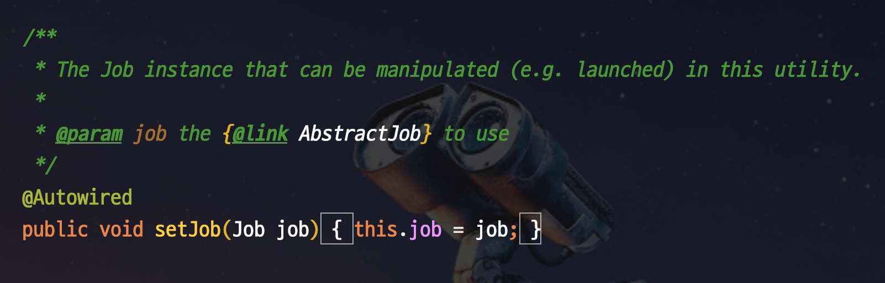

## Test

배치 어플리케이션은 웹 어플리케이션보다 테스트 코드 작성이 수월하고 그 효과가 좋다. UI 검증이 필요한 웹 어플리케이션에 비해 Java 코드 검증만 필요한 배치 어플리케이션 테스트 코드가 수월하기 때문이다.

### 10-1. 통합 테스트

스프링 배치 모듈 사이에서 ItemReader만 뽑아내 쿼리를 테스트 해볼 수 있는 환경을 SetUp하려면 여러가지 장치가 필요하다. 따라서 단위 테스트 작성보다는 통합 테스트가 더 쉬운 부분이 있다.

웹 어플리케이션의 테스트 코드와 달리 스프링 배치의 테스트 코드는 특이성이 있기에 이 부분을 고려한 쉽게 접근 가능한 통합 테스트 코드를 알아본다.

- 의존성에 `spring-boot-starter-test`가 꼭 있어야 한다.

### 4.0.x 이하 (부트 2.0 이하) 버전

4.1 하위 버전의 배치는 다음과 같이 통합 테스트를 수행한다.

```java
@RunWith(SpringRunner.class)
@SpringBootTest(classes={BatchJpaTestConfiguration.class, TestBatchLegacyConfig.class}) // (1)
public class BatchIntegrationTestJobConfigurationLegacyTest {

    @Autowired
    private JobLauncherTestUtils jobLauncherTestUtils; // (2)

    @Autowired
    private SalesRepository salesRepository;

    @Autowired
    private SalesSumRepository salesSumRepository;

    @After
    public void tearDown() throws Exception {
        salesRepository.deleteAllInBatch();
        salesSumRepository.deleteAllInBatch();
    }

    @Test
    public void 기간내_Sales가_집계되어_SalesSum이된다() throws Exception {
        //given
        LocalDate orderDate = LocalDate.of(2019,10,6);
        int amount1 = 1000;
        int amount2 = 500;
        int amount3 = 100;

        salesRepository.save(new Sales(orderDate, amount1, "1"));
        salesRepository.save(new Sales(orderDate, amount2, "2"));
        salesRepository.save(new Sales(orderDate, amount3, "3"));

        JobParameters jobParameters = new JobParametersBuilder() 
                .addString("orderDate", orderDate.format(FORMATTER))
                .toJobParameters();

        //when
        JobExecution jobExecution = jobLauncherTestUtils.launchJob(jobParameters); // (3)

        //then
        assertThat(jobExecution.getStatus()).isEqualTo(BatchStatus.COMPLETED);
        List<SalesSum> salesSumList = salesSumRepository.findAll();
        assertThat(salesSumList.size()).isEqualTo(1);
        assertThat(salesSumList.get(0).getOrderDate()).isEqualTo(orderDate);
        assertThat(salesSumList.get(0).getAmountSum()).isEqualTo(amount1+amount2+amount3);
    }
}
```

1. `@SpringBootTest(classes={...})`
    - 통합 테스트 실행시 사용할 Java 설정들을 선택
    - `BatchJpaTestConfiguration` : 테스트할 Batch Job
    - `TestBatchLegacyConfig` : 배치 테스트 환경 (아래에서 설명)
2. `JobLauncherTestUtils`
    - Batch Job을 테스트 환경에서 실행할 Utils 클래스이다.
    - CLI 등으로 실행하던 Job을 **테스트 코드에서 실행**할 수 있도록 지원
3. `jobLauncherTestUtils.launchJob(jobParameter)`
    - JobParameter와 함께 Job을 실행한다.
        - 운영 환경에서는 CLI로 배치를 수행하겠지만, 지금같은 테스트 코드에서는 `JobLauncherTestUtils`를 통해 Job을 수행하고 결과를 검증한다.
    - 해당 Job의 결과는 `JobExecution`에 담겨 반환된다.
    - 성공적으로 Batch가 수행되었는지는 `jobExecution.getStatus()`로 검증한다.

1을 보면 알 수 있듯이 어떤 Batch를 수행할지 Config 클래스로 지정되어있다. 여기서는 `BatchJpaTestConfiguration` Job이 수행된다는 것을 알 수 있다. 이외의 나머지 클래스들은 불러오지 않기 때문에 실행 대상에서 자동으로 제외된다.

자동으로 제외될 수 있는 이유는 `JobLauncherTestUtils`가 `@Autowired setJob()`로 현재 Bean에 올라간 Job을 주입받기 때문이다.



(출처: [원본 게시물, jojoldu님 블로그](https://jojoldu.tistory.com/455?category=902551))

현재 실행하는 테스트 환경에서 `Job`클래스의 Bean은 `class={}`에 등록된 `BatchJpaTestConfiguration`의 Job 하나 뿐이라 자동 선택되는 것이다.

JobLaunacherTestUtils는 여러개의 Job Bean 중 어떤것을 선택해야할지 알 수 없기 때문에 `@SpringBootTest(calsses={...})`를 통해 단일 Job Config만 선택하도록 한다.

`TestBatchLegacyConfig`는 어떤 역할일까? 이는 해당 클래스의 코드를 통해 설명한다.

```java
@Configuration
@EnableAutoConfiguration
@EnableBatchProcessing
public class TestBatchLegacyConfig {

    @Bean
    public JobLauncherTestUtils jobLauncherTestUtils(){
        return new JobLauncherTestUtils();
    }
}
```

1. `@EnableBatchProcessing`
    - 배치 환경을 자동 설정한다.
    - 테스트 환경에서도 필요하기 때문에 별도의 설정에서 선언되어 사용한다.
        - 모든 테스트 클래스에서 선언하는 불편함을 없앤다.
2. `@Bean JobLauncherTestUtils`
    - 스프링 배치 테스트 유틸인 `JobLauncherTestUtils`를 Bean 등록한다.
        - `JobLauncherTestUtils`를 이용해서 JobParameter를 사용한 Job 실행 등이 이루어진다.
    - `JobLauncherTestUtils`: Bean을 각 테스트 코드에서 `@Autowired`로 호출해서 사용한다.

### 4.1.x 이상 (부트 2.1 이상) 버전

스프링 배치 4.1에서 새로운 어노테이션 `@SpringBatchTest`이 추가되었다.

해당 어노테이션을 추가하면 자동으로 ApplicationContext에 테스트에 필요한 여러 유틸 Bean을 등록해준다.

```
Tip) ApplicationContext는 Spring의 Bean 컨테이너이다.
여기에 Spring의 Bean들이 모두 담겨있고 
이를 가져와서 사용할 수 있다고 보면 된다.
```

자동 등록되는 빈은 총 4개이다.

- JobLauncherTestUtils
    - 스프링 배치 테스트에 필요한 전반적인 유틸 기능 지원
- JobRepositoryTestUtils
    - DB에 생성된 JobExecution을 쉽게 생성/삭제 가능하게 지원
- StepScopeTestExecutionListener
    - 배치 단위 테스트시 StepScope 컨텍스트 생성
    - 해당 컨텍스트를 통해 JobParameter등을 단위 테스트에서 DI 받을 수 있음
- JobScopeTestExecutionListener
    - 배치 단위 테스트시 JobScope 컨텍스트를 생성
    - 해당 컨텍스트 통해 JobParameter등을 단위 테스트에서 DI 받을 수 있음

여기서 `JobLauncherTestUtils`와 `JobRepositoryTestUtils`는 통합 테스트에 필요한 Bean들이며, `StepScopeTestExecutionListener`와 `JobScopeTestExecutionListener`는 단위 테스트 환경에서 필요한 Bean들이다.

스프링 배치 테스트 코드 작성에 필요한 Bean들을 미리 다 제공해준다고 생각할 수 있다. 이제 `@SpringBatchTest`를 통해 코드를 개선해본다.

```java
@RunWith(SpringRunner.class)
@SpringBatchTest
**@**SpringBootTest(classes={BatchJpaTestConfiguration.class, TestBatchConfig.class})
public class BatchIntegrationTestJobConfigurationNewTest {
		...
}
```

1. `@SpringBatchTest`
    - Spring Batch 4.1 버전에 새롭게 추가된 어노테이션
    - 현재 테스트에선 `JobLauncherTestUtils`를 지원받기 위해 사용
2. `TestBatchConfig.class`
    - `@SpringBatchTest`로 인해 불필요한 설정이 제거된 Config 클래스

새롭게 추가될 `TestBatchConfig`클래스의 코드는 아래가 전부이다.

```java
@Configuration
@EnableAutoConfiguration
@EnableBatchProcessing
public class TestBatchConfig {}
```

기존에 생성해주던 `JobLauncherTestUtils`가 모두 `@SpringBatchTest`를 통해 자동 Bean으로 등록되니 직접 생성해줄 필요가 없다.